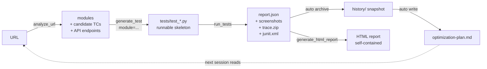

<p align="center">
  
</p>

<h1 align="center">MK QA Master</h1>

<p align="center">
  <em>AI 測試大師 — your AI QA loop, from analyze to advise.</em>
</p>

<p align="center">
  <strong>English</strong> · <a href="README.zh-TW.md">繁體中文</a>
</p>

<p align="center">
  <a href="https://pypi.org/project/mk-qa-master/"></a>
  <a href="https://github.com/kao273183/mk-qa-master/actions/workflows/ci.yml"></a>
  <a href="https://glama.ai/mcp/servers/kao273183/mk-qa-master"></a>
  <a href="LICENSE"></a>
  <a href="https://www.buymeacoffee.com/minikao"></a>
</p>

> Universal MCP server for running tests across pytest / Jest / Cypress / Go,
> with built-in DOM analyzer, run history, and a self-improvement coach.
> **Stable since v1.0.0 (2026-06-02)** — see
> [Stability promise](#stability-promise-v100) below.

A **Model Context Protocol** server that lets Claude Desktop / Cursor / any
MCP client drive your test suite end-to-end: run tests, inspect failures
(screenshot + video + trace), analyze a live URL to draft test cases, and —
after each run — produce a prioritized action plan telling you exactly what
to fix or write next.

| `QA_RUNNER` | Framework | Language | Target |
|---|---|---|---|
| `pytest` / `pytest-playwright` / `playwright` | pytest + Playwright | Python | Web |
| `jest` | Jest | JavaScript | Web |
| `cypress` | Cypress | JavaScript | Web |
| `go` / `go-test` | `go test` | Go | Backend |
| `maestro` / `mobile` | Maestro | YAML | iOS + Android |
| `schemathesis` / `api` | Schemathesis | OpenAPI 3.x / Swagger 2.0 | API (since v0.6.0) |
| `newman` / `postman` | Newman | Postman collection v2.x | API (since v0.6.1) |

Full design notes: [`docs/framework.md`](docs/framework.md).

---

## What's in the box

- **Run tests** across multiple frameworks (web + mobile + API) via a single MCP surface
- **Mobile via Maestro** (since v0.3.0): same MCP tools, iOS Simulator /
  Android Emulator / real device; YAML flows; cross-platform without rewrites
- **Native API testing — two runners** (since v0.6.0 / v0.6.1): two peers
  now share the API testing slot, each fed by the artifact your team
  already maintains.
  - **Schemathesis** (`QA_RUNNER=schemathesis`, since v0.6.0): point at an
    OpenAPI 3.x / Swagger 2.0 URL or `file://` schema and get property-based
    fuzzed tests covering status codes, response schemas, content types,
    and `5xx`-on-fuzz violations.
  - **Newman** (`QA_RUNNER=newman`, since v0.6.1): point at an exported
    Postman 2.x collection (plus optional environment / globals files) and
    Newman replays every request, runs the embedded `pm.test(...)`
    assertions, and returns one mk-qa-master nodeid per assertion. Newman
    is a **system prerequisite** (`npm install -g newman`) — it's an npm
    package, not pip, so it doesn't ship as a Python extra.

  Both drop into the same MCP tool surface as the web / mobile runners, and
  both feed the same `report.json` / history / flake / optimizer pipeline.
  Existing API tests written in pytest+`httpx`, Jest+`supertest`, Cypress
  `cy.request()`, or Go `net/http/httptest` still ride their existing
  runners — no migration needed. Pact provider verification stays on the
  v0.7.0 conditional roadmap.
- **Failure artifacts**: screenshot (base64-inlined), video, Playwright
  trace.zip / Maestro recordings
- **Run history**: every run snapshotted; HTML report shows a sparkline trend
- **DOM / Screen analyzer** — `analyze_url` for web (forms / nav / dialogs /
  CTAs + the API endpoints the page hits) and `analyze_screen` for mobile
  (`maestro hierarchy` → form / cta / tab_bar modules)
- **Smart test generation** (`generate_test`): hand it an analyzer module
  and it writes a runnable Playwright `.py` or Maestro `.yaml` with concrete
  selectors, not `# TODO` stubs
- **Auto-retry flakes** — pytest side via `pytest-rerunfailures`; Maestro
  side via custom retry wrapper (no native `--reruns`); flaky tests
  surfaced separately from real failures
- **Self-improvement coach** (`get_optimization_plan`): post-run analysis
  across three lenses — suite quality, MCP usability, AI generation effectiveness
- **JUnit XML output** for CI integrations (GitHub Actions / Jenkins / GitLab)

---

## Install

Two paths — pick the one that matches how you'll use it.

### A. Run via `uvx` (zero install, recommended for end users)

Add `mk-qa-master` to your client config without installing anything globally; [`uv`](https://docs.astral.sh/uv/) fetches and runs it in an ephemeral environment per session:

```json
{
  "mcpServers": {
    "mk-qa-master": {
      "command": "uvx",
      "args": ["mk-qa-master"],
      "env": { "QA_RUNNER": "pytest", "QA_PROJECT_ROOT": "/path/to/your-test-project" }
    }
  }
}
```

That's the whole setup. First call downloads the package; subsequent calls are cached. Switching versions: `uvx mk-qa-master@0.4.1 ...`.

### B. Install into a project venv (for contributors / hacking)

```bash
pip install mk-qa-master       # or: pip install -e . from a clone
playwright install                # only if you use pytest-playwright
pip install pytest-rerunfailures  # optional, enables auto-retry
```

Then point your client config at the same Python interpreter:

```json
"command": "/path/to/.venv/bin/python",
"args": ["-m", "mk_qa_master.server"]
```

### Verify the install (v1.4+)

```bash
mk-qa-master doctor          # human-readable check report
mk-qa-master doctor --json   # for CI gates / host-LLM consumption
```

Walks Python version, ffmpeg + mediamtx on PATH, core deps, `[edge]` extras, runner registry, and MCP tool surface. Exits **0** when nothing critical is missing (warnings about unused features don't fail), **1** when mk-qa-master can't run cleanly. Run it after a fresh install or when an MCP tool returns `missing_extras`.

### Runner-specific prerequisites

| `QA_RUNNER` | You also need |
|---|---|
| `pytest` / `pytest-playwright` | `pip install pytest-playwright` + `playwright install chromium` |
| `jest` | A Node project with `jest` installed (`npm i -D jest`) |
| `cypress` | A Node project with `cypress` installed (`npm i -D cypress`) |
| `go` | Go toolchain on PATH |
| `maestro` | [Maestro CLI](https://maestro.mobile.dev/) + a booted simulator / emulator / device (or BlueStacks reachable via `adb connect`) |
| `schemathesis` / `api` | `pip install 'mk-qa-master[api]'` (pulls in `schemathesis>=3.0,<4`) |
| `newman` / `postman` | `npm install -g newman` (Newman is an npm package, not pip — no extra to install) |


## API testing (`QA_RUNNER=schemathesis`)

Point the runner at any OpenAPI 3.x / Swagger 2.0 schema and Schemathesis
generates property-based test cases per operation — covering response
schema conformance, status code conformance, content-type checks, and
`5xx`-on-fuzz. Results flow through the same `report.json` / history /
flake / optimizer pipeline as your UI tests.

End-to-end walkthrough lives in [`docs/walkthrough-api.md`](docs/walkthrough-api.md);
a self-contained 3-endpoint sample lives at
[`examples/sample_api_project/`](examples/sample_api_project/).

### 5-line config

```jsonc
"env": {
  "QA_RUNNER": "schemathesis",
  "QA_OPENAPI_URL": "https://api.example.com/openapi.json"
}
```

### Environment variables

| Variable | Required | Default | What it does |
|---|---|---|---|
| `QA_OPENAPI_URL` | yes | — | OpenAPI URL. `http(s)://...` for live schemas, `file://...` for local files. **Plain filesystem paths are not accepted** — they need the `file://` prefix. |
| `QA_SCHEMATHESIS_CHECKS` | no | `all` | Comma-separated subset: `response_schema_conformance,status_code_conformance,not_a_server_error,content_type_conformance,response_headers_conformance`. |
| `QA_SCHEMATHESIS_AUTH` | no | — | Authorization header value. Sent as `-H "Authorization: <value>"`. Never logged; redacted from archived reports. |
| `QA_SCHEMATHESIS_MAX_EXAMPLES` | no | `20` | Hypothesis examples per operation. Higher = deeper fuzz, slower run. |
| `QA_SCHEMATHESIS_DRY_RUN` | no | `0` | Set to `1` to plan-without-HTTP — useful for safety preview against production, or CI smoke against a schema-only artifact. |
| `QA_NO_REDACT` | no | `0` | Disables secret redaction in archived reports. Default redacts `Authorization: Bearer …`, `"password": …`, `"token" / "api_key" / "secret" / "access_token" / "refresh_token": …`. |

Standard `QA_TIMEOUT_SECONDS` still applies (default 600s).


## API testing (`QA_RUNNER=newman`)

Point the runner at any exported Postman 2.x collection and Newman 6.x
replays every request, runs the embedded `pm.test(...)` assertions, and
returns one mk-qa-master "test" per assertion. Results flow through the
same `report.json` / history / flake / optimizer pipeline as the
Schemathesis and UI runners.

**System prerequisite**: Newman ships via npm, not pip. Install once:

```bash
npm install -g newman
```

There's no `pip install 'mk-qa-master[postman]'` extra — the runner
just shells out to the `newman` binary on PATH. If it's missing, the
runner raises a clear `ImportError` pointing at the npm install line.

The same 3-endpoint **Library API** that the OpenAPI sample targets
ships as a Postman collection at
[`examples/sample_api_project/postman-collection.json`](examples/sample_api_project/postman-collection.json) —
pair it with `prism mock examples/sample_api_project/openapi.yaml` for
a fully self-contained dev loop, or point at your own staging server.

### 5-line config

```jsonc
"env": {
  "QA_RUNNER": "newman",
  "QA_POSTMAN_COLLECTION": "/absolute/path/to/your-collection.json"
}
```

### Environment variables

| Variable | Required | Default | What it does |
|---|---|---|---|
| `QA_POSTMAN_COLLECTION` | yes | — | Plain filesystem path to a Postman 2.x collection JSON. **No `file://` prefix** — Newman doesn't need scheme disambiguation since collections are always local artifacts. |
| `QA_POSTMAN_ENVIRONMENT` | no | — | Plain path to a Postman environment file (`-e <path>`). Provides values for `{{var_name}}` placeholders in the collection. |
| `QA_POSTMAN_GLOBALS` | no | — | Plain path to a Postman globals file (`-g <path>`). Same shape as the environment, globally scoped. |
| `QA_POSTMAN_ITERATIONS` | no | `1` | Replay the whole collection N times (`-n <N>`). Useful for soak tests and flake detection. |
| `QA_POSTMAN_FOLDER` | no | — | CSV of Postman folder names to restrict the run to (repeated `--folder` flags). `run_failed` also uses folder-scoping when failures cluster in known folders. |
| `QA_POSTMAN_TIMEOUT_REQUEST_MS` | no | `30000` | Per-request HTTP timeout in milliseconds (`--timeout-request`). Distinct from `QA_TIMEOUT_SECONDS`, which caps the whole subprocess. |
| `QA_NO_REDACT` | no | `0` | Same redaction policy as the Schemathesis runner — disable only for short debug sessions. |

Standard `QA_TIMEOUT_SECONDS` still applies (default 600s).


## AI Visual Challenge Solver (v0.7.0)

> *When backend bypass isn't an option: Claude looks at the CAPTCHA, mk-qa-master does the clicks.*

Supports reCAPTCHA v2 (since v0.7.0) and hCaptcha (since v0.7.1).

The first capability in the family where the AI client's vision is
load-bearing, not optional. Two new MCP tools
(`inspect_visual_challenge` + `solve_visual_challenge`) detect a
reCAPTCHA v2 or hCaptcha image-grid challenge on the active Playwright
page, screenshot it for the multimodal AI client, accept the
tile-selection the AI returns, and execute the click chain. The
runner is the eyes and hands; the AI client (Claude / Cursor / Gemini
/ GPT-4o) is the actual solver.

### When to use this — Tier 1 vs Tier 3

The built-in QA knowledge layer (`get_qa_context section="CAPTCHA"`)
codifies three tiers. Reach for them in order:

| Tier | Approach | When |
|---|---|---|
| **1 — bypass** | reCAPTCHA test keys, feature flags, IP allowlist, test-mode headers | Default. Covers ~90% of cases. |
| **2 — degrade** | Mark as `external_dependency`, skip downstream assertions | When you can't change the backend but the test isn't about the CAPTCHA itself. |
| **3 — AI visual judgment** | This feature. | Only when 1 + 2 don't fit (client sites with authorization but no backend access, staging that mirrors prod CAPTCHA, mobile webviews where IP allowlist isn't reachable). |

### Consent gate

The solver does nothing until you explicitly opt in. Two env vars drive
it:

| Variable | Required | Default | What it does |
|---|---|---|---|
| `QA_VISUAL_CHALLENGE_CONSENT` | yes | `false` | Must be set to `true` for either tool to function. Without it, both tools return a `consent_required` error carrying the full legal disclaimer (the AI client surfaces this to the user). |
| `QA_VISUAL_CHALLENGE_AUTHORIZED_DOMAINS` | no (recommended) | — | Comma-separated allowlist of domains where the tool may operate. When SET, refuses any other domain. When UNSET, warn-only — proceeds but stamps the response with a warning telling you to set one. **Recommended** for shared CI / multi-tenant environments. |
| `QA_VISUAL_CHALLENGE_TIMEOUT` | no | `120` | Wall-clock budget in seconds for the inspect→solve cycle. Honors `QA_TIMEOUT_SECONDS` as a hard ceiling. |

### Quick start

```jsonc
"env": {
  "QA_RUNNER": "pytest",
  "QA_PROJECT_ROOT": "/path/to/project",
  "QA_VISUAL_CHALLENGE_CONSENT": "true",
  "QA_VISUAL_CHALLENGE_AUTHORIZED_DOMAINS": "client-staging.example.com"
}
```

Then, when a `run_tests` call surfaces an `external_dependency`
failure that points at a CAPTCHA, the AI client can escalate:

```
mk-qa-master.inspect_visual_challenge()  # screenshot + tile grid
→ AI vision picks tiles [0, 4, 7]
mk-qa-master.solve_visual_challenge(
    challenge_id="...", selected_tile_indices=[0, 4, 7], confirm=true,
)
→ status: "passed", token: "...", hint: "CAPTCHA verified. Resume your test."
```

Full walkthrough lives in [`docs/walkthrough-visual-challenge.md`](docs/walkthrough-visual-challenge.md).
PRD: [`docs/prd-v0.7-visual-challenge.md`](docs/prd-v0.7-visual-challenge.md).

### Hard-stop domains

Regardless of consent or allowlist, the solver refuses to operate on
known third-party identity providers (`accounts.google.com`,
`login.microsoftonline.com`, `id.apple.com`, `facebook.com`,
`login.live.com`, etc.). No legitimate QA scenario justifies a
CAPTCHA solver against someone else's login portal.

### Privacy

No screenshot retention beyond the active inspect→solve cycle.
Telemetry logs the boolean outcome only — never the screenshot, never
the challenge text, never the tile selection. The 5-minute LRU cache
holds at most 10 outstanding challenges per process and never touches
disk.

### Success rate caveat

The AI client's vision model does the actual judging — Claude Sonnet
4, GPT-4o, and Gemini 2.5 all ship with native vision but their
accuracy on a 3x3 reCAPTCHA varies. Plan for at least one retry per
challenge (reCAPTCHA gives you three before locking out). `get_telemetry`
will eventually surface aggregate pass-rate so you can size that
expectation per-client.

**Scope**: reCAPTCHA v2 image-grid only in v0.7.0. hCaptcha lands in
v0.7.1. reCAPTCHA v3 / Cloudflare Turnstile are permanently out of
scope — they don't surface a visible challenge to inspect.


## OWASP API Security scanning (v0.8.0)

> *Schemathesis catches correctness drift. v0.8.0 adds the layer that
> catches the security drift hiding behind a passing schema.*

v0.8.0 ships an **OWASP API Security Top 10 (2023) rule-based scanner**
as a new MCP tool: `run_api_security_scan`. It loads an OpenAPI 3.x
spec, walks each (path × method), and dispatches five purely-HTTP-
observable rules:

| OWASP # | Rule | Severity when triggered |
|---|---|---|
| API1 | **BOLA / IDOR** — alice's token reads bob's object via path-id tampering | CRITICAL |
| API2 | **Broken Authentication** — server accepts `alg:none`, malformed, or wrong-signature JWTs | MEDIUM / HIGH / CRITICAL by probe |
| API3 | **Mass Assignment** — server persists dangerous extra fields like `role: admin`, `is_verified: true` | HIGH |
| API5 | **Function-Level Authz** — non-admin user accesses admin-shaped endpoints | HIGH |
| API8 | **Security Misconfiguration** — missing HSTS/CSP/X-Frame headers, wildcard CORS with credentials | LOW / MEDIUM / HIGH |

API4 (rate limit DoS risk), API6 (business flow modeling), API7
(SSRF callback infra), API9 (prod recon), API10 (upstream APIs) are
**deferred** — see [`docs/prd-v0.8-api-security.md`](docs/prd-v0.8-api-security.md) §3.

### Consent + authorization gates

Mirrors the v0.7 visual-challenge consent model:

| Variable | Required | What it does |
|---|---|---|
| `QA_API_SECURITY_CONSENT` | yes | Must be `true`. Without it, returns `consent_required`. |
| `QA_API_SECURITY_AUTHORIZED_DOMAINS` | yes for external hosts | Comma-separated allowlist. Localhost / 127.0.0.1 are implicitly authorized. |

The `mass_assignment` rule mutates server state — it's **excluded from
default categories**. Callers must opt in:
`categories=["headers", "broken_auth", "bola", "function_authz", "mass_assignment"]`.

### Quick start

```jsonc
"env": {
  "QA_RUNNER": "pytest",
  "QA_PROJECT_ROOT": "/path/to/project",
  "QA_API_SECURITY_CONSENT": "true",
  "QA_API_SECURITY_AUTHORIZED_DOMAINS": "api.staging.example.com"
}
```

Then ask the AI client to scan:

```
mk-qa-master.run_api_security_scan(
    spec_url="https://api.staging.example.com/openapi.yaml",
    auth={
        "token": "alice's bearer token",
        "alt_user_token": "bob's bearer token",
        "bola_test_ids": {"user_a": [101, 103], "user_b": [202]}
    },
    severity_threshold="medium"
)
```

Returns the v0.8 security report block:

```jsonc
{
  "scan_id": "a3f8d1c9b7e2",
  "spec_url": "...",
  "base_url": "https://api.staging.example.com",
  "categories_run": ["headers", "broken_auth", "bola", "function_authz"],
  "rules_ran": ["OWASP-API8-Headers", "OWASP-API2-BrokenAuth", ...],
  "ops_scanned": 23,
  "severity_threshold": "medium",
  "findings": [
    {
      "rule_id": "OWASP-API1-BOLA-CrossUserDataExposure",
      "severity": "critical",
      "endpoint": "GET /orders/{id}",
      "title": "user_a can read user_b's object id=202 — missing object-level authorization check",
      "evidence": {"actor": "user_a", "target_owner": "user_b", "target_id": 202, "probed_path": "/orders/202", "status_code": 200, ...},
      "remediation_hint": "Compare the caller's identity to the object's owner before returning..."
    },
    ...
  ],
  "summary": {"total": 7, "by_severity": {"critical": 2, "high": 4, "medium": 1, "low": 0, "info": 0}}
}
```

### The Tier 1 ground truth

`examples/sample_vulnerable_api/` ships a deliberately-vulnerable
Flask app where every in-scope OWASP category has a vuln/safe
endpoint pair. Run it locally to see what each rule looks like in
action:

```bash
cd examples/sample_vulnerable_api
pip install -r requirements.txt
python app.py  # binds 127.0.0.1:5099
# Then from another shell, point run_api_security_scan at
# http://127.0.0.1:5099 + the bundled openapi.yaml
```

The scanner finds all 5 categories on `/vuln/*` and produces zero
false positives on `/safe/*`. That property is enforced by the
[Tier 1 dogfood tests](examples/sample_vulnerable_api/tests/) on
every PR.

### Security note

The scanner runs adversarial test cases. Do not point it at
production systems you don't own, and do not point it at any system
where you don't have authorization. The two env vars above are the
contract.

PRD: [`docs/prd-v0.8-api-security.md`](docs/prd-v0.8-api-security.md).
The earlier v0.8 mobile attempt was parked — see
[`docs/v0.8-mobile-postmortem.md`](docs/v0.8-mobile-postmortem.md) for
what we learned and how it shaped the API-security PRD's testing
gates.


## Use as a Claude Code / Codex / Hermes / OpenClaw skill (v0.9.0)

> *Same skill folder loads in four different agent hosts via the
> [agentskills.io](https://agentskills.io) convention.*

v0.9.0 packages mk-qa-master as a **cross-host agent skill** in addition
to its MCP-server form. The `skills/mk-qa-master/` folder is the single
source of truth — the same `SKILL.md`, slash commands, and reference
docs load into:

- **Claude Code** — via `.claude-plugin/plugin.json` (this repo is a
  plugin marketplace).
- **OpenAI Codex** — via `.codex-plugin/plugin.json` (Codex reads Claude-
  style marketplaces).
- **OpenClaw** — install from local checkout: `openclaw plugins install
  /path/to/mk-qa-master`.
- **Hermes Agent** — symlink the skill folder into `~/.hermes/skills/`.

### Quick install (Claude Code)

```text
# Inside Claude Code:
/plugin marketplace add kao273183/mk-qa-master
/plugin install mk-qa-master@mk-qa-master
```

Restart Claude Code so the skill registers. Then any QA testing prompt
auto-activates the skill — or explicitly invoke a slash command:

```
/mk-qa-master:run-tests login
/mk-qa-master:generate https://staging.example.com
/mk-qa-master:api-security https://api.staging.example.com/openapi.yaml
```

### What the skill does

The skill is a single-file operating contract that teaches the host how
to drive mk-qa-master's 22 MCP tools coherently. It encodes:

- **When to auto-activate** — phrases like "run my tests", "why did this
  test fail", "scan this API for OWASP issues" trigger it.
- **Five flows** — run tests / generate tests / debug failures / solve
  CAPTCHAs / scan APIs.
- **Hard rules** — surface consent errors verbatim, don't silently
  re-run with relaxed filters, confirm before destructive runs.

Full reference at [`skills/mk-qa-master/SKILL.md`](skills/mk-qa-master/SKILL.md).

### Why a skill on top of an MCP server?

The MCP server makes the 22 tools **callable** by any client. The skill
makes them **discoverable + governed**: it gives the host's skill router
enough context to decide *when* to use the tools and *which flow* to
follow. Inspired by [microsoft/Webwright](https://github.com/microsoft/Webwright),
which uses the same pattern.


## Stability promise (v1.0.0)

> *22 tools. Frozen schema. Versioned drift. Pin and go.*

mk-qa-master shipped v1.0.0 on 2026-06-02. The MCP tool surface is locked: **22 tools, the consent gate env vars, the plan / bookend shapes, and the hard-stop blacklists** don't change without a deprecation cycle.

### What this means for callers

| If you pin… | What you get |
|---|---|
| `mk-qa-master==1.0.*` | Patch releases only (bugfixes; no surface change) |
| `mk-qa-master==1.*` | Minor releases (additive only: new tools, new optional args, new fields) |
| `mk-qa-master>=1,<2` | Same as above |

Breaking changes require a v2.0 bump. Deprecations get **≥ 1 minor of warning** with `DeprecationWarning` raised at runtime, "Deprecated:" in the MCP tool description, and an entry in `docs/MIGRATION-1.x-to-2.0.md` (created when v2.0 work opens).

### How the promise is enforced

A CI snapshot test (`tests/test_v1_schema_snapshot.py`) freezes the 22-tool surface in `tests/snapshots/v1/tool_surface.json`. Any drift fails CI unless the PR sets `BREAKING_CHANGE_ACK=true` AND both `docs/MIGRATION-0.x-to-1.0.md` and `docs/DEPRECATION-POLICY.md` exist. The ack alone isn't a free pass — the docs must be in place.

A second test (`tests/test_v1_doc_sync.py`) scans every public doc for tool-count claims and fails if any disagree with the live server.

### Read the contract

- [`docs/MIGRATION-0.x-to-1.0.md`](docs/MIGRATION-0.x-to-1.0.md) — every additive shape change v0.7 → v1.0 enumerated. TL;DR: v0.10 → v1.0 is a no-op.
- [`docs/DEPRECATION-POLICY.md`](docs/DEPRECATION-POLICY.md) — formal cycle. patch = bugfix, minor = additive, major = removal (only after deprecation).
- [`docs/prd-v1.0-stability-lock.md`](docs/prd-v1.0-stability-lock.md) — locked PRD.


## License Evolution Plan (v1.2.1 announcement)

> *MIT today. Apache 2.0 in v2.0.*

mk-qa-master is announcing that it will **relicense from MIT to Apache 2.0 in v2.0.0**. This patch (v1.2.1) is the formal announcement and starts the deprecation clock.

### What changes for you

| If you pin... | What you get |
|---|---|
| `mk-qa-master==1.0.*` / `==1.1.*` / `==1.2.*` etc. | **MIT forever** — every v1.x release stays MIT-licensed |
| `mk-qa-master>=1,<2` | MIT for as long as you stay on v1.x |
| `mk-qa-master>=2,<3` (when v2.0 ships) | Apache 2.0 |

Apache 2.0 grants **strictly more rights** than MIT (explicit patent grant + trademark protection) while keeping the same commercial-use permission. **No scenario reduces your usage rights.**

### Timeline

- **v1.2.1** (this release): announcement only. No code changes.
- **v1.3.x onwards**: still MIT. Hold cycle for at least one minor before v2.0 lands.
- **v2.0.0** (TBD): actual relicense. Apache 2.0 LICENSE file, NOTICE file, source-header sweep, manifest sync.

Plus a **commitment to maintain v1.x bugfix releases for ≥ 6 months after v2.0.0 ships**. If your company can't move to Apache 2.0 immediately, you have a runway.

### Why

Long-term sustainability — patent peace, trademark protection, contributor IP unambiguity, broader corporate procurement compatibility. See [`docs/RELICENSING.md`](docs/RELICENSING.md) for the full rationale + mechanical v2.0 checklist.


## Edge AI Runner (v1.1.0+)

> *RTSP stream + YOLO inference + pytest assertions in a single `QA_RUNNER=edge` flag.*

v1.1.0 adds an Edge AI Inference Runner that drops into the same `analyze → generate → run` loop the web and mobile runners already use. The new `analyze_stream` MCP tool (tool #22) probes RTSP geometry and emits candidate test cases per detected label.

### Quick install

```bash
pip install "mk-qa-master[edge]"   # opencv-python + ultralytics + requests

# Plus the binary deps the runner shells out to:
brew install ffmpeg mediamtx       # macOS
# or: sudo apt install ffmpeg + download mediamtx from https://github.com/bluenviron/mediamtx
```

### End-to-end walkthrough

The bundled sample fixture at [`examples/sample_edge_fixture/`](examples/sample_edge_fixture/) exercises the full loop. Tested against `mk-qa-master==1.1.0` (Edge AI), `mk-qa-master==1.1.1` (housekeeping), and `1.1.2` (this doc patch).

**1. Configure the runner.** Three env vars are enough for the desktop path:

```bash
export QA_RUNNER=edge
export QA_RTSP_SOURCE="$(pwd)/examples/sample_edge_fixture/factory.mp4"
export QA_MODEL_PATH=yolov8n.pt    # ultralytics auto-downloads on first use
```

Optional tuning (defaults in parentheses): `QA_MIN_FPS` (25), `QA_LATENCY_SLA_MS` (40), `QA_IOU_THRESHOLD` (0.5).

**2. Ask Claude / Cursor / any MCP host.** With mk-qa-master wired as an MCP server (see [Wire into Claude Desktop](#wire-into-claude-desktop-legacy-mcp-only-path)), prompt:

> *"analyze the stream at `examples/sample_edge_fixture/factory.mp4` with the bundled annotations sidecar, then generate detection tests for each label."*

Claude calls `analyze_stream` → gets `{width: 320, height: 240, fps: 5, labels: ["forklift", "person"], candidate_tcs: [...]}` → calls `generate_test` per label → writes `test_edge_factory_person.py` and `test_edge_factory_forklift.py` to `PROJECT_ROOT/tests/`.

**3. Run.** The runner brings up local `mediamtx` + `ffmpeg` (the file source loops over RTSP), exports `EDGE_*` env vars from the `QA_*` you set, and invokes pytest. Each generated test:

- Reads frames via `cv2.VideoCapture(EDGE_RTSP_URL)`
- Pushes each frame through the YOLO backend
- Tracks per-frame latency in a `LatencyTracker`
- Asserts the per-label detection appears within the IoU threshold for at least one frame in the ground-truth window
- Asserts p95 latency ≤ `EDGE_LATENCY_SLA_MS`
- Asserts sustained throughput ≥ `EDGE_MIN_FPS` over a 150-frame window

The report lands in `PROJECT_ROOT/report.json` + `junit.xml`, gets archived under `test-results/history/`, and triggers `get_optimization_plan` like any other runner.

### Vendor-host safety default

`analyze_stream` refuses RTSP URLs at known surveillance / IoT camera vendor domains (Dahua, Hikvision, Ezviz, Axis, Amcrest, Lorex, Swann, Reolink) by default. Keeps accidental probing of public camera feeds off the default path. Set `QA_EDGE_ALLOW_VENDOR_HOSTS=true` to opt in for own-camera testing.

### Resilience injection (v1.3.0)

v1.3.0 adds an opt-in network degradation harness for Edge runs. Pass `resilience_mode="netem"` to `generate_test` and the emitted pytest uses Linux `tc qdisc` (via `mk_qa_master.edge.resilience.apply_netem`) to inject 200 ms latency + 5 % packet loss on the loopback interface, asserts the runner stays within SLA under degradation, then clears the qdisc on teardown.

Double-guarded for safety:

- `apply_netem` raises `RuntimeError` on non-Linux (macOS / Windows hosts → tests `pytest.skip` automatically).
- Even on Linux it refuses to run until `QA_EDGE_NETEM_ENABLED=true` — explicit consent for the loopback impact.

The same module also ships three companion helpers: `clear_netem` (idempotent teardown), `kill_ffmpeg_subprocess` (process-loss scenario), and `build_corrupted_gop_fixture` (ffmpeg-driven bitstream noise injection). See [`src/mk_qa_master/edge/resilience.py`](src/mk_qa_master/edge/resilience.py) and the v1.3.0 PRD for the full menu.

When tests run under resilience mode, the emitted report carries an additive per-test `edge_metrics` block (frame drops, recovery time, etc.). `get_optimization_plan` reads it to surface 4 Edge-specific flake signals (corrupted-frame rate, recovery-time skew, drop bursts, sustained latency violations) alongside its usual signal mix.

### Phase status

| Phase | What | Status |
|---|---|---|
| 1 | Desktop YOLO runner + RTSP source mgmt + metrics | ✅ v1.1.0 |
| 2 | `analyze_stream` MCP tool + edge `generate_test` template | ✅ v1.1.0 |
| housekeeping | Sample fixture + `edge-sample` CI + EN/zh-TW Edge knowledge section | ✅ v1.1.1 |
| docs | README walkthrough + troubleshooting (this section) | ✅ v1.1.2 |
| 3 | Remote inference (`RemoteHTTP.infer()` + `QA_JETSON_HOST` real probe) | ✅ v1.2.0 |
| 4 | Resilience injection + Edge flake signals + degradation scenarios | ✅ v1.3.0 |

### Troubleshooting

| Symptom | Likely cause | Fix |
|---|---|---|
| `Could not open RTSP stream: rtsp://localhost:8554/cam` | ffmpeg or mediamtx not on PATH; readiness probe timed out at 10 s | Verify `which ffmpeg mediamtx`; if mediamtx lives elsewhere, set `QA_MEDIAMTX_BIN=/full/path/to/mediamtx`; slow first-run on Apple Silicon — re-run after the first mediamtx boot |
| `[edge] setup failed: ConnectionError` | Port 8554 already in use by another mediamtx / RTSP server | Set `QA_RTSP_PORT=8555` (or any free port); the generated test reads `EDGE_RTSP_URL` so no test edit needed |
| `{ "error": "missing_extras", "hint": ... }` from `analyze_stream` | Base install without `[edge]` extras | `pip install "mk-qa-master[edge]"` (or run `mk-qa-master doctor` to audit the full install) |
| `{ "error": "forbidden_vendor_host", "blocked_host": "..." }` | Default-on blacklist (Dahua / Hikvision / etc.) | If it's your own camera: `export QA_EDGE_ALLOW_VENDOR_HOSTS=true`. If it isn't: leave the block in place |
| `NotImplementedError: RemoteHTTP backend lands in v1.2 (Phase 3 of theme G)` | You set `QA_JETSON_HOST` or `QA_INFERENCE_ENDPOINT` against v1.1.x | v1.1 ships LocalYolo only. Unset the remote env vars to fall back to desktop YOLO. Phase 3 follows in v1.2 |
| `ultralytics` taking forever to install | First-time torch download (~700 MB) | One-time cost. Cache `pip install` in CI; locally use `pip install --no-deps` once torch is in place |
| Generated test asserts `hit, "label X not detected"` but the sample fixture is just `testsrc` | Synthetic test pattern doesn't contain real persons / forklifts | Expected for the bundled fixture (it's plumbing verification only). Swap in real footage + real annotations for actual detection assertions; see [`examples/sample_edge_fixture/README.md`](examples/sample_edge_fixture/README.md) |
| p95 latency assertion fires on CPU but passes on GPU | Default `QA_LATENCY_SLA_MS=40` assumes GPU inference | Raise `QA_LATENCY_SLA_MS` for CPU runs (typical CPU yolov8n: 60–120 ms). See the SLA defaults table in `get_qa_context(section="Edge Vision Inference")` |
| ffmpeg complains about `Stream #0:0: Video: ... at 5/1 fps` | Sample fixture is intentionally low fps (5) to keep the binary at 75KB | Expected. For real testing supply your own higher-fps source |

### Migration from v1.0.0 → v1.1.x

v1.0.0 → v1.1.0 is **additive only** — no existing tool changed shape. v1.1.0 → v1.1.1 → v1.1.2 are patch releases (housekeeping + docs). v1.2.0 added Phase 3 (remote inference). v1.3.0 added Phase 4 (resilience injection + Edge flake signals). See [`docs/MIGRATION-1.x.md`](docs/MIGRATION-1.x.md) for the full change log + the list of new `QA_*` env vars (`QA_EDGE_NETEM_ENABLED`, …).

Full PRD: [`docs/prd-v1.1-edge-ai-runner.md`](docs/prd-v1.1-edge-ai-runner.md).


## Universal plan + verify bookend (v0.10.0)

> *Declare success up front, run the work, get a checklist back — on every
> meaningful tool, not just one.*

v0.10.0 generalizes the v0.9.4 bookend pattern (which lived only on
`run_api_security_scan`) to **5 core tools**. Each one accepts an
optional `plan_id` kwarg returned by `qa_plan`. When you thread that
`plan_id` through, the tool's response gains a `plan_verification`
envelope that auto-verifies the work against the critical points you
declared — no separate `verify_plan` call needed.

| Tool | Evidence shape | Typical CP |
|---|---|---|
| `run_tests` | pytest-json-report's `tests` array (per-test result) | `"test_login passes"` / `"suite duration < 30s"` |
| `solve_visual_challenge` | Single record: `{kind, status, token_populated, rounds_used, fingerprint, challenge_id}` — **raw token NEVER in evidence** | `"captcha solved AND token_populated"` |
| `analyze_url` | One row per discovered module (with `kind`, `selectors`, source URL) | `"form module discovered"` / `"≥1 cta found"` |
| `auto_generate_tests` | One row per generated test (success or failure) | `"form module produced ≥1 test"` / `"no generation errors"` |
| `run_api_security_scan` (v0.9.4) | One row per OWASP finding | `"BOLA finding on /orders endpoint"` |

```python
plan = qa_plan(
    task="Smoke the signup flow",
    critical_points=[
        {"id": "CP1", "verification_hint": "test_happy_path passes"},
        {"id": "CP2", "verification_hint": "BOLA-on-orders"},
    ],
)

result = run_tests(plan_id=plan["plan_id"])

# result["plan_verification"]["status"] == "passed" | "incomplete" | "failed"
# result["plan_verification"]["checklist"] tells you per-CP outcomes
```

Backward compat: omitting `plan_id` keeps the v0.9.x response shape
intact. See [`docs/prd-v0.10-universal-bookend.md`](docs/prd-v0.10-universal-bookend.md)
for per-tool evidence contracts and the locked decisions.


## Wire into Claude Desktop (legacy MCP-only path)

If you prefer the bare MCP-server wiring (no plugin/skill layer), copy
`examples/configs/claude_desktop_config.example.json` to:

- **macOS**: `~/Library/Application Support/Claude/claude_desktop_config.json`
- **Windows**: `%APPDATA%\Claude\claude_desktop_config.json`

Two environment variables drive the runtime:

| Variable | Example | What it does |
|---|---|---|
| `QA_RUNNER` | `pytest` / `jest` / `cypress` / `go` / `maestro` / `schemathesis` / `newman` | Selects which test framework |
| `QA_PROJECT_ROOT` | `/path/to/your/project` | Points at the project under test |
| `QA_ANDROID_HOST` *(optional)* | `127.0.0.1:5555` | Remote-ADB endpoint for **BlueStacks** / Genymotion / Nox / cloud Android. When set, the Maestro runner auto-runs `adb connect <host>` before each test / `analyze_screen` call. Requires `adb` on PATH. |
| `QA_TIMEOUT_SECONDS` *(optional)* | `600` (default) | Hard ceiling on any single subprocess invocation (pytest / jest / cypress / go test / maestro). Returns `exit_code=124` with a `[TIMEOUT…]` tag in stderr when exceeded, so the AI client can react cleanly instead of hanging the MCP server forever. |

### Per-runner snippet

**pytest-playwright**:
```json
"env": { "QA_RUNNER": "pytest", "QA_PROJECT_ROOT": "/path/to/python-project" }
```

**Jest**:
```json
"env": { "QA_RUNNER": "jest", "QA_PROJECT_ROOT": "/path/to/node-project" }
```

**Cypress**:
```json
"env": { "QA_RUNNER": "cypress", "QA_PROJECT_ROOT": "/path/to/cypress-project" }
```

**Go test**:
```json
"env": { "QA_RUNNER": "go", "QA_PROJECT_ROOT": "/path/to/go-project" }
```

**Maestro (mobile, since v0.3.0)**:
```json
"env": {
  "QA_RUNNER": "maestro",
  "QA_PROJECT_ROOT": "/path/to/maestro-flows",
  "QA_ANDROID_HOST": "127.0.0.1:5555"
}
```
`QA_ANDROID_HOST` is optional — only set it when targeting BlueStacks / Genymotion / cloud-Android-farm via remote ADB. iOS Simulator / Android Emulator / local USB device auto-discovered.

**Schemathesis (API)**:
```json
"env": {
  "QA_RUNNER": "schemathesis",
  "QA_OPENAPI_URL": "https://api.example.com/openapi.json"
}
```

**Newman (Postman)**:
```json
"env": {
  "QA_RUNNER": "newman",
  "QA_POSTMAN_COLLECTION": "/absolute/path/to/collection.json"
}
```

**Edge AI (RTSP + YOLO, since v1.1.0)**:
```json
"env": {
  "QA_RUNNER": "edge",
  "QA_RTSP_SOURCE": "/absolute/path/to/factory.mp4",
  "QA_MODEL_PATH": "yolov8n.pt"
}
```
Requires `pip install "mk-qa-master[edge]"` + ffmpeg + mediamtx on PATH. See the [Edge AI Runner walkthrough](#edge-ai-runner-v110) for the full env-var table and troubleshooting.

---

## Other MCP clients

MCP is an open protocol — this server isn't Claude-only. The same Python
process talks to any MCP client over JSON-RPC stdio. What differs across
clients is (1) the config file format and (2) how reliably the underlying
model auto-chains tool calls.

| Client | Config | Format | Model | Tool-chain quality |
|---|---|---|---|---|
| Claude Desktop / Cursor | `~/Library/Application Support/Claude/...json` · `~/.cursor/mcp.json` | JSON | Claude Opus / Sonnet | Best tested |
| **Codex CLI** | `~/.codex/config.toml` | **TOML** | GPT-5 family | Strong (well-trained on tool chaining) |
| **Gemini CLI** | `~/.gemini/settings.json` | JSON | Gemini 3.1 Pro / Flash | Works; prefers explicit prompts ("first analyze, then write") |
| Cline / Continue / Zed | each has its own MCP config slot | varies | varies | depends on configured model |

Example configs ship in the repo:
[`codex-config.example.toml`](examples/configs/codex-config.example.toml) ·
[`gemini-config.example.json`](examples/configs/gemini-config.example.json) ·
[`claude_desktop_config.example.json`](examples/configs/claude_desktop_config.example.json).

Codex (TOML):
```toml
[mcp_servers.mk-qa-master]
command = "/path/to/.venv/bin/python"
args = ["-m", "mk_qa_master.server"]
cwd = "/path/to/mk-qa-master"
[mcp_servers.mk-qa-master.env]
QA_RUNNER = "pytest"
QA_PROJECT_ROOT = "/path/to/your-test-project"
```

Gemini (JSON, same shape as Claude Desktop):
```json
{
  "mcpServers": {
    "mk-qa-master": {
      "command": "/path/to/.venv/bin/python",
      "args": ["-m", "mk_qa_master.server"],
      "cwd": "/path/to/mk-qa-master",
      "env": {
        "QA_RUNNER": "pytest",
        "QA_PROJECT_ROOT": "/path/to/your-test-project"
      }
    }
  }
}
```

Tool descriptions already nudge the recommended chains
(`analyze_url → generate_test`, `get_qa_context` before generating
domain tests). Clients with weaker tool-selection benefit most from
explicit prompts that name the steps.

---

## Tool surface

Shared across all runners (some tools degrade gracefully on non-pytest runners):

| Tool | Purpose |
|---|---|
| `get_runner_info` | Which runner is active + all available ones |
| `list_tests` | Enumerate tests in the project |
| `run_tests` | Run tests (filter / headed / browser; last two pytest-playwright only) |
| `run_failed` | Re-run last failures (`pytest --lf`) |
| `get_test_report` | Summary (pass / fail / skipped / duration / flaky-in-run) |
| `get_failure_details` | Per-failure message + screenshot / trace / video paths |
| `generate_test` | Test skeleton; with `module` from `analyze_url`/`analyze_screen`, a *runnable* one (Playwright `.py` or Maestro `.yaml`) |
| `auto_generate_tests` | One-shot: analyze URL → generate one test per discovered module |
| `codegen` | Launch Playwright codegen (web) / hint to `maestro studio` (mobile) |
| `generate_html_report` | Render the latest run as self-contained HTML |
| `get_test_history` | Last N archived run summaries (for trend / flake debugging) |
| `analyze_url` | **Web**: DOM probe → modules + selectors + candidate TCs + API endpoints + layout overflow warnings |
| `analyze_screen` | **Mobile**: `maestro hierarchy` → form / cta / tab_bar modules + candidate TCs (noise-filtered) |
| `init_qa_knowledge` / `get_qa_context` | Scaffold + read the project's QA knowledge layer (methodology + domain). **Bilingual since v0.6.2** — methodology ships in English by default (`QA_LANG=en`) or Traditional Chinese (`QA_LANG=zh-tw`); same 13 sections in both, the four newest cover API testing methodology, flakiness root-cause taxonomy, test doubles (mock / stub / fake / spy), and test data management. Domain example: [`docs/qa-knowledge-en.example.md`](docs/qa-knowledge-en.example.md) (zh-TW: [`docs/qa-knowledge.example.md`](docs/qa-knowledge.example.md)). |
| `get_optimization_plan` | Three-layer self-improvement coach (suite / MCP / AI strategy) |
| `inspect_visual_challenge` / `solve_visual_challenge` | **v0.7.0** AI Visual Challenge Solver — detect a reCAPTCHA v2 image-grid challenge, screenshot it, accept the AI client's tile selection, execute the click chain. Gated by `QA_VISUAL_CHALLENGE_CONSENT=true` + per-call `confirm=true`. See the dedicated section above. |
| `run_api_security_scan` | **v0.8.0** OWASP API Security Top 10 (2023) rule-based scanner — load an OpenAPI 3.x spec, walk path × method, dispatch 5 in-scope rules (API1 BOLA, API2 Broken Auth, API3 Mass Assignment, API5 Function-Level Authz, API8 Misconfig). Gated by `QA_API_SECURITY_CONSENT=true` + `QA_API_SECURITY_AUTHORIZED_DOMAINS`. See the dedicated section above. |

### Resources

| URI | What |
|---|---|
| `report://html` | Live-rendered HTML report (dark mode, self-contained) |
| `report://json` | Raw pytest-json-report JSON |
| `report://optimization` | Latest `optimization-plan.md` |

---

## Self-improvement loop

After every run, `_archive_report()` snapshots `report.json` into
`test-results/history/` and writes a fresh `optimization-plan.md` covering:

1. **Suite quality** — outcomes string per test (`PFPFP`); transitions → flake
   score; 3+ identical-signature fails → broken; rerun-passed → flaky-in-run
2. **MCP usability** — top tools, error rates, repeat-arg patterns, common
   A→B chains (from telemetry JSONL logs)
3. **AI strategy** — adoption rate of `generate_test` outputs, coverage gaps
   from `analyze_url` modules with no matching test files

The plan emits prioritized actions (`high` / `medium` / `low`) each with
target + evidence + suggestion + optional `auto_action_hint` the MCP client
can chain into the next tool call.

---

## Project layout

```
mk-qa-master/
├── pyproject.toml
├── src/mk_qa_master/
│   ├── server.py            # MCP entry (tool routing + telemetry wrap)
│   ├── config.py            # Paths + env vars
│   ├── runners/             # Per-framework plugins
│   │   ├── base.py          # TestRunner abstract interface
│   │   ├── pytest_playwright.py
│   │   ├── jest.py
│   │   ├── cypress.py
│   │   └── go_test.py
│   ├── reporters/
│   │   └── html.py          # Self-contained HTML render
│   └── tools/               # Thin shims + analyzer + optimizer + telemetry
└── tests_project/           # Example project under test
```

---

## Adding a runner

1. Create `src/mk_qa_master/runners/your_runner.py`, subclass `TestRunner`,
   implement the abstract methods
2. Register the name in `runners/__init__.py`'s `REGISTRY`
3. Done

---

## End-to-end workflow

The intended pipeline — from a URL to "what should I improve next time":



The loop is the point: every run feeds the optimizer, the optimizer
points at the weakest link, the next run hits that link first.

### Walkthrough — testing a login page

In a Claude / Cursor session:

> **You**: 分析 `https://shop.example/login`，幫我寫對應測試
>
> **Claude**: [`analyze_url`] Found 1 form (`email_password_form_0`) + 3 API
> endpoints. 5 candidate TCs.
> [`generate_test` with the form module] Wrote `tests/test_login.py` —
> runnable with concrete selectors, no `# TODO` stubs.

> **You**: 跑
>
> **Claude**: [`run_tests`] 23 passed, 0 failed in 31s. Screenshots + step
> traces captured for every test.

> **You**: 下一步該做什麼？
>
> **Claude**: [opens `report://optimization`]
> Top: `tests/test_login.py::test_invalid_credentials` is flaky
> (flake_score=0.4, outcomes=PFPFP). Suggestion: add
> `wait_for_response('/api/login')` before asserting the error message.

The three optimizer lenses (suite quality / MCP usability / AI generation
effectiveness) make every "下一步" answer data-driven, not gut feel.

### Walkthrough — testing a mobile app (Maestro)

Same shape, different runner. Requires Maestro CLI installed +
simulator/emulator booted + your app launched (or pass `launch_app=true`
with `app_id`):

> **You**: 分析 your mobile app 首頁的條碼按鈕、寫對應測試
>
> **Claude**: [`analyze_screen`(app_id="com.example.app", launch_app=true)]
> Found 15 interactive elements; matched `barcode_button`
> (text="條碼", resource_id="barcodeButton") + candidate TCs.
> [`generate_test` with the cta module] Wrote `maestro-flows/test_barcode.yaml` —
> `tapOn: { id: barcodeButton }` + waitForAnimationToEnd + takeScreenshot,
> ready to `maestro test`.

> **You**: 跑
>
> **Claude**: [`run_tests`] 5 flows pass, retry didn't fire. Screenshots
> embedded in HTML report.

> **You**: 上面這個按鈕有時候會 fail、為什麼？
>
> **Claude**: [`get_optimization_plan`] `barcode_button::barcode_button` flagged
> flaky (flake_score=0.4, outcomes=PFPFP, rerun_count=1). Suggestion: 加
> `waitForAnimationToEnd` 或 `extendedWaitUntil` 等動畫穩定後再 tap。

Mobile-specific notes:
- The same `qa-knowledge.md` (built-in methodology + your domain) feeds
  both web and mobile runs — write your business rules once.
- `analyze_screen` filters out iOS status bar (signal / wifi / battery)
  and asset-name labels (`bg_*`, `*_filled`); the result is signal-heavy.
- Maestro's `takeScreenshot: <name>` directive controls which screens
  show up as inline images in the HTML report.

---

## Prompting cookbook

Each row shows a phrase you can paste into a Claude / Cursor session and
the underlying MCP tool call it should trigger. Use as a reference for
"how do I get the AI to do X without naming the tool myself."

### One-time setup
| You say | Claude calls |
|---|---|
| "Initialize the QA knowledge file." | `init_qa_knowledge` → writes `qa-knowledge.md` to your project root |
| "Show me the current QA knowledge." | `get_qa_context` → methodology + your domain sections |
| "Open the ISTQB principles section." | `get_qa_context(section="ISTQB")` |

### Day-to-day testing
| You say | Claude calls |
|---|---|
| "Run all tests." | `run_tests` |
| "Run only login-related tests." | `run_tests(filter="login")` |
| "Re-run just the failures." | `run_failed` |
| "Show me the summary." | `get_test_report` |
| "Which ones failed? Give me screenshots and trace." | `get_failure_details` |
| "Generate the HTML report." | `generate_html_report` |

### Building tests from a URL (web)
| You say | Claude calls |
|---|---|
| "Auto-generate tests for `https://shop.example/`." | `auto_generate_tests(url=...)` — one-shot |
| "Analyze `https://shop.example/coupon` first, then write one test per module." | `analyze_url` → `generate_test` × N |
| "Analyze coupon page and write a regression test for our past idempotency bug." | `get_qa_context(section="Bug")` → `analyze_url` → `generate_test(business_context=...)` |
| "Just record a checkout flow as a baseline." | `codegen(url=...)` |

### Building tests from a mobile screen (Maestro)
Requires `QA_RUNNER=maestro`, Maestro CLI, and a booted simulator/emulator/device.

| You say | Claude calls |
|---|---|
| "Analyze the current your mobile app screen and write a test for the barcode button." | `analyze_screen(app_id="com.example.app", launch_app=true)` → `generate_test(module=<cta>)` |
| "Test the login form on this app." | `analyze_screen(launch_app=true)` → pick `form` module → `generate_test` |
| "Cover the tab bar — write one flow per tab." | `analyze_screen` → take the `tab_bar` module → `generate_test` |
| "Use Maestro Studio to record a flow." | `codegen(url=...)` returns a hint pointing at `maestro studio` (record + save manually) |

**BlueStacks / remote Android instances**: set `QA_ANDROID_HOST=127.0.0.1:5555`
(or whatever host:port BlueStacks exposes — see *Settings → Advanced → Android
Debug Bridge*). The Maestro runner will `adb connect` before each test and
`analyze_screen`, and bumps the `hierarchy` timeout to 60s to absorb the
slower TCP-ADB path. Genymotion / Nox / LDPlayer / WSA work the same way;
any `host:port` that responds to `adb connect` is fine.

### Continuous improvement
| You say | Claude calls |
|---|---|
| "What should I fix next?" | `get_optimization_plan` |
| "Has `test_login_invalid` been flaky lately?" | `get_test_history` + plan lookup |
| "Why did it fail? Show me the trace." | `get_failure_details` (returns screenshot/trace/video paths) |

### Tips — getting Claude to pick the right tool

- **Mention QA knowledge explicitly** — "**reference qa knowledge** when testing coupon" pushes Claude to call `get_qa_context` first; saying just "test coupon" may skip it.
- **State the order** — "**analyze first**, then write" forces `analyze_url` before `generate_test`; "just write a test for X" skips analysis.
- **Batch vs precise** — "auto-generate the whole page" → `auto_generate_tests`; "write one test per candidate_tc" → manual chain.
- **Failure debugging** — Asking "why did it fail / show me the screenshot" reliably triggers `get_failure_details` (which now returns screenshot + trace + video paths).

### Anti-patterns
- ❌ "Run it 5 times to see if it's flaky" — the runner has auto-retry + history; just ask "is it flaky" and let `get_optimization_plan` answer.
- ❌ "Generate 100 tests" — noise > signal. Use `get_optimization_plan` first to find what's missing.
- ❌ "Test all edge cases" — too vague. Phrase as "test every `candidate_tc` for this form" — concrete, bounded, traceable.

---

## Sample outputs

### `analyze_url` (excerpt)

```json
{
  "url": "https://shop.example/login",
  "page_title": "Login",
  "module_count": 3,
  "modules": [
    {
      "kind": "form",
      "name": "email_password_form_0",
      "selectors": {
        "container": "#login",
        "fields": [
          {"label": "Email", "selector": "#email", "type": "email", "required": true},
          {"label": "Password", "selector": "#password", "type": "password", "required": true}
        ],
        "submit": "button[type='submit']"
      },
      "candidate_tcs": [
        "所有必填欄位為空時送出，應顯示必填錯誤",
        "Email 欄位填入格式錯誤的字串（無 @），應顯示格式錯誤",
        "Password 欄位輸入後應預設遮蔽（type=password）",
        "全部填入合法值後送出，應觸發成功流程"
      ]
    }
  ],
  "api_endpoints": [
    {
      "method": "POST",
      "path": "/api/login",
      "status": 401,
      "candidate_tcs": [
        "POST /api/login payload 缺必填欄位應回 400 + 欄位錯誤訊息",
        "POST /api/login 合法 payload 應回 2xx",
        "POST /api/login 缺少 auth header 應回 401/403"
      ]
    }
  ]
}
```

### `generate_test` output (smart, with module)

```python
"""
Login happy path

Auto-generated from analyze_url module: email_password_form_0 (kind=form)
"""
from playwright.sync_api import Page, expect


def test_login(page: Page):
    page.goto('https://shop.example/login')
    page.locator('#email').fill('test@example.com')
    page.locator('#password').fill('TestPass123!')
    page.locator("button[type='submit']").click()
    # TC: Email 欄位填入格式錯誤的字串（無 @），應顯示格式錯誤
    # TC: Password 欄位輸入後應預設遮蔽
    # TC: 正確 Email + 正確密碼 → 導向 dashboard
    # TODO: 補上實際斷言，例如：
    # expect(page).to_have_url(...)
    # expect(page.get_by_text("成功")).to_be_visible()
```

### `optimization-plan.md` (excerpt)

```markdown
# Optimization Plan — 2026-05-12T14:03:40

_Based on 6 archived runs._

## Prioritized Actions

### 1. 🔴 HIGH — flaky
- **Target**: `tests/test_login.py::test_invalid_credentials`
- **Evidence**: flake_score=0.4, outcomes=PFPFP, rerun_count=1
- **Suggestion**: 加 explicit wait（wait_for_response / locator wait）

### 2. 🟡 MEDIUM — coverage_gap
- **Target**: `register_form`
- **Evidence**: 由 analyze_url 偵測但 repo 內找不到對應 test_*.py
- **Suggestion**: `call generate_test(description="...", filename="test_register_form.py")`
```

### HTML report

[**Open the live rendered demo →**](https://htmlpreview.github.io/?https://github.com/kao273183/mk-qa-master/blob/main/sample_report.html)
(served via GitHub Pages — clicking the link in GitHub's UI to
[`sample_report.html`](sample_report.html) would only show source).

The demo shows the stats grid, trend sparkline, failure cards with embedded
screenshots + step lists, and the collapsed Passed section.

---

## Integrations

`mk-qa-master` doesn't bundle third-party SDKs — it stays a pure
test-execution + analysis layer. Real QA workflows are composed by
running multiple MCP servers side-by-side in the same client config;
**Claude orchestrates the chain across servers**. There's no MCP-to-MCP
RPC — each server is independent, the AI client is the conductor.

The pairings below are the ones that complete the loop most often:

| Pair with | Why | Example chain |
|---|---|---|
| **[Atlassian MCP](https://www.atlassian.com/platform/remote-mcp-server)** *(JIRA + Confluence)* | Auto-open bug tickets from failures; sync `optimization-plan.md` to a team Confluence page | `run_tests` → `get_failure_details` → `atlassian.createJiraIssue` *(attaches screenshot + trace path)* |
| **[Slack MCP](https://github.com/modelcontextprotocol/servers/tree/main/src/slack)** | Notify channels on failure, share the rendered HTML report, mention oncall for flaky tests | `generate_html_report` → `slack.send_message(channel="#qa-bots", attachments=...)` |
| **[GitHub MCP](https://github.com/github/github-mcp-server)** | Read PR description / linked issues for *business context* before generating tests; post results back as PR comments | `github.get_pull_request` → `analyze_url` → `generate_test(business_context=PR body)` → `github.create_issue_comment` |
| **[Sentry MCP](https://github.com/getsentry/sentry-mcp)** | Production errors drive regression priority: top crashes → matching regression tests | `sentry.list_issues(sort="frequency")` → `generate_test(business_context=stack trace)` → `run_tests` |
| **[Filesystem MCP](https://github.com/modelcontextprotocol/servers/tree/main/src/filesystem)** | Read a shared `qa-knowledge.md` or TC source files that live outside `QA_PROJECT_ROOT` (monorepos, multi-project setups) | `filesystem.read_file("~/shared/qa-knowledge.md")` → `init_qa_knowledge` |

**Honorable mention — [Google Drive MCP](https://github.com/modelcontextprotocol/servers/tree/main/src/gdrive)**: pairs with Google-Sheet-based TC management (read TCs from a sheet → `generate_test` → write status back).

### Composing in your client config

All five run as separate processes alongside `mk-qa-master`:

```json
{
  "mcpServers": {
    "mk-qa-master": { "command": "python", "args": ["-m", "mk_qa_master.server"], "env": { "QA_RUNNER": "maestro" } },
    "atlassian":       { "command": "npx", "args": ["-y", "@atlassian/mcp"] },
    "slack":           { "command": "npx", "args": ["-y", "@modelcontextprotocol/server-slack"] },
    "github":          { "command": "npx", "args": ["-y", "@modelcontextprotocol/server-github"] }
  }
}
```

Then a single prompt walks the chain:

> "Run the checkout suite. For each failure, open a JIRA in project QA with the RIDER format and the screenshot attached. Post the HTML report to #qa-bots when done."

Why this matters: `mk-qa-master` stays focused on the test loop
(analyze → generate → run → coach). JIRA / Slack / Sentry are entire
domains with their own dedicated servers — bolting them into this one
would dilute the scope, duplicate auth handling, and force every user
to inherit dependencies they may not want.

本 repo 不打包任何第三方 SDK——維持「測試執行 + 分析」單一職責。實務上 QA 工作流是**多個 MCP server 並存、由 Claude 編排跨 server 的 tool chain**達成的。範例配套：JIRA / Slack / GitHub / Sentry / Filesystem 各自獨立 MCP server，配上 `mk-qa-master` 拼出完整測試管線。

---

## Publishing (maintainer-only)

Releases ship to PyPI via [Trusted Publishing](https://docs.pypi.org/trusted-publishers/) — no API tokens stored in the repo. The flow:

1. Bump `version = "x.y.z"` in `pyproject.toml` (via a normal PR — main is branch-protected).
2. After merge, tag main and push:
   ```bash
   git tag -a vX.Y.Z -m "vX.Y.Z — short summary"
   git push origin vX.Y.Z
   ```
3. Create a GitHub Release for that tag (`gh release create vX.Y.Z ...`).
4. The release event fires `.github/workflows/publish.yml` → builds sdist + wheel → uploads to PyPI.

One-time PyPI setup (must be done once before the first publish works):

- Sign in at https://pypi.org → enable 2FA.
- Project page → *Settings → Publishing* → add a **pending publisher** with:
  - Owner: `kao273183`
  - Repository: `mk-qa-master`
  - Workflow filename: `publish.yml`
  - Environment name: `pypi`

After the first successful run, PyPI auto-promotes the pending publisher to a trusted one and subsequent releases authenticate via OIDC.

The workflow refuses to publish if the release tag doesn't match `pyproject.version`, which catches "tagged but forgot to bump" mistakes before they hit PyPI.

---

## Support the project ☕

`mk-qa-master` is built and maintained solo on nights and weekends. If it saved you time or shaped how your team thinks about AI-driven QA, a coffee keeps the late-night Maestro debugging sessions going:

[](https://www.buymeacoffee.com/minikao)

Your support funds: keeping this repo free + actively maintained, more device variants for Maestro testing (real iPhones / Android tablets / BlueStacks), recorded tutorials for the QA community, and the next 2am bug hunt.

No ads, no sponsorships, no enterprise upsell — just the work.

---

## Contributing

This repo is **maintained solo**. Ideas and bug reports are very welcome — please open an [Issue](https://github.com/kao273183/mk-qa-master/issues/new/choose) or start a [Discussion](https://github.com/kao273183/mk-qa-master/discussions). I read every one and will implement what fits the project's direction.

**External pull requests are auto-closed.** Not because contributions aren't appreciated, but because keeping the codebase coherent under a single voice matters more here than the throughput a multi-contributor model would bring. If you really want a specific change, an Issue describing the problem gets you further than a PR.

本 repo 由我一人維護。歡迎透過 Issue / Discussion 提想法或回報問題，我會親自評估並實作。**外部 PR 會自動關閉**——不是不歡迎貢獻，而是想保持程式碼風格與走向一致。

---

## License

MIT © 2026 Jack Kao — see [`LICENSE`](LICENSE)
(中文翻譯參考: [`LICENSE.zh-TW.md`](LICENSE.zh-TW.md); the English version is
authoritative).

In plain English: you can use this for anything (personal projects, commercial
work, modifications, redistribution). The only ask is that you keep the
copyright + license notice in any copy you ship. There's no warranty — use
at your own risk.
