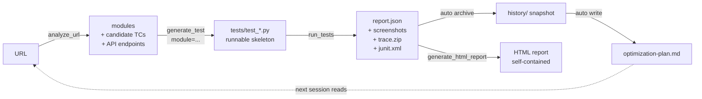

<p align="center">
  
</p>

<h1 align="center">MK QA Master</h1>

<p align="center">
  <em>AI 測試大師 — your AI QA loop, from analyze to advise.</em>
</p>

<p align="center">
  <strong>English</strong> · <a href="README.zh-TW.md">繁體中文</a>
</p>

<p align="center">
  <a href="https://pypi.org/project/mk-qa-master/"></a>
  <a href="LICENSE"></a>
  <a href="https://www.buymeacoffee.com/minikao"></a>
</p>

> Universal MCP server for running tests across pytest / Jest / Cypress / Go,
> with built-in DOM analyzer, run history, and a self-improvement coach.

A **Model Context Protocol** server that lets Claude Desktop / Cursor / any
MCP client drive your test suite end-to-end: run tests, inspect failures
(screenshot + video + trace), analyze a live URL to draft test cases, and —
after each run — produce a prioritized action plan telling you exactly what
to fix or write next.

| `QA_RUNNER` | Framework | Language | Target |
|---|---|---|---|
| `pytest` / `pytest-playwright` / `playwright` | pytest + Playwright | Python | Web |
| `jest` | Jest | JavaScript | Web |
| `cypress` | Cypress | JavaScript | Web |
| `go` / `go-test` | `go test` | Go | Backend |
| `maestro` / `mobile` | Maestro | YAML | iOS + Android |

Full design notes: [`docs/framework.md`](docs/framework.md).

---

## What's in the box

- **Run tests** across multiple frameworks (web + mobile) via a single MCP surface
- **Mobile via Maestro** (since v0.3.0): same MCP tools, iOS Simulator /
  Android Emulator / real device; YAML flows; cross-platform without rewrites
- **Failure artifacts**: screenshot (base64-inlined), video, Playwright
  trace.zip / Maestro recordings
- **Run history**: every run snapshotted; HTML report shows a sparkline trend
- **DOM / Screen analyzer** — `analyze_url` for web (forms / nav / dialogs /
  CTAs + the API endpoints the page hits) and `analyze_screen` for mobile
  (`maestro hierarchy` → form / cta / tab_bar modules)
- **Smart test generation** (`generate_test`): hand it an analyzer module
  and it writes a runnable Playwright `.py` or Maestro `.yaml` with concrete
  selectors, not `# TODO` stubs
- **Auto-retry flakes** — pytest side via `pytest-rerunfailures`; Maestro
  side via custom retry wrapper (no native `--reruns`); flaky tests
  surfaced separately from real failures
- **Self-improvement coach** (`get_optimization_plan`): post-run analysis
  across three lenses — suite quality, MCP usability, AI generation effectiveness
- **JUnit XML output** for CI integrations (GitHub Actions / Jenkins / GitLab)

---

## Install

Two paths — pick the one that matches how you'll use it.

### A. Run via `uvx` (zero install, recommended for end users)

Add `mk-qa-master` to your client config without installing anything globally; [`uv`](https://docs.astral.sh/uv/) fetches and runs it in an ephemeral environment per session:

```json
{
  "mcpServers": {
    "mk-qa-master": {
      "command": "uvx",
      "args": ["mk-qa-master"],
      "env": { "QA_RUNNER": "pytest", "QA_PROJECT_ROOT": "/path/to/your-test-project" }
    }
  }
}
```

That's the whole setup. First call downloads the package; subsequent calls are cached. Switching versions: `uvx mk-qa-master@0.4.1 ...`.

### B. Install into a project venv (for contributors / hacking)

```bash
pip install mk-qa-master       # or: pip install -e . from a clone
playwright install                # only if you use pytest-playwright
pip install pytest-rerunfailures  # optional, enables auto-retry
```

Then point your client config at the same Python interpreter:

```json
"command": "/path/to/.venv/bin/python",
"args": ["-m", "mk_qa_master.server"]
```

### Runner-specific prerequisites

| `QA_RUNNER` | You also need |
|---|---|
| `pytest` / `pytest-playwright` | `pip install pytest-playwright` + `playwright install chromium` |
| `jest` | A Node project with `jest` installed (`npm i -D jest`) |
| `cypress` | A Node project with `cypress` installed (`npm i -D cypress`) |
| `go` | Go toolchain on PATH |
| `maestro` | [Maestro CLI](https://maestro.mobile.dev/) + a booted simulator / emulator / device (or BlueStacks reachable via `adb connect`) |


## Wire into Claude Desktop

Copy `examples/configs/claude_desktop_config.example.json` to:

- **macOS**: `~/Library/Application Support/Claude/claude_desktop_config.json`
- **Windows**: `%APPDATA%\Claude\claude_desktop_config.json`

Two environment variables drive the runtime:

| Variable | Example | What it does |
|---|---|---|
| `QA_RUNNER` | `pytest` / `jest` / `cypress` / `go` / `maestro` | Selects which test framework |
| `QA_PROJECT_ROOT` | `/path/to/your/project` | Points at the project under test |
| `QA_ANDROID_HOST` *(optional)* | `127.0.0.1:5555` | Remote-ADB endpoint for **BlueStacks** / Genymotion / Nox / cloud Android. When set, the Maestro runner auto-runs `adb connect <host>` before each test / `analyze_screen` call. Requires `adb` on PATH. |
| `QA_TIMEOUT_SECONDS` *(optional)* | `600` (default) | Hard ceiling on any single subprocess invocation (pytest / jest / cypress / go test / maestro). Returns `exit_code=124` with a `[TIMEOUT…]` tag in stderr when exceeded, so the AI client can react cleanly instead of hanging the MCP server forever. |

### Per-runner snippet

**pytest-playwright**:
```json
"env": { "QA_RUNNER": "pytest", "QA_PROJECT_ROOT": "/path/to/python-project" }
```

**Jest**:
```json
"env": { "QA_RUNNER": "jest", "QA_PROJECT_ROOT": "/path/to/node-project" }
```

**Cypress**:
```json
"env": { "QA_RUNNER": "cypress", "QA_PROJECT_ROOT": "/path/to/cypress-project" }
```

**Go test**:
```json
"env": { "QA_RUNNER": "go", "QA_PROJECT_ROOT": "/path/to/go-project" }
```

---

## Other MCP clients

MCP is an open protocol — this server isn't Claude-only. The same Python
process talks to any MCP client over JSON-RPC stdio. What differs across
clients is (1) the config file format and (2) how reliably the underlying
model auto-chains tool calls.

| Client | Config | Format | Model | Tool-chain quality |
|---|---|---|---|---|
| Claude Desktop / Cursor | `~/Library/Application Support/Claude/...json` · `~/.cursor/mcp.json` | JSON | Claude Opus / Sonnet | Best tested |
| **Codex CLI** | `~/.codex/config.toml` | **TOML** | GPT-5 family | Strong (well-trained on tool chaining) |
| **Gemini CLI** | `~/.gemini/settings.json` | JSON | Gemini 3.1 Pro / Flash | Works; prefers explicit prompts ("first analyze, then write") |
| Cline / Continue / Zed | each has its own MCP config slot | varies | varies | depends on configured model |

Example configs ship in the repo:
[`codex-config.example.toml`](examples/configs/codex-config.example.toml) ·
[`gemini-config.example.json`](examples/configs/gemini-config.example.json) ·
[`claude_desktop_config.example.json`](examples/configs/claude_desktop_config.example.json).

Codex (TOML):
```toml
[mcp_servers.mk-qa-master]
command = "/path/to/.venv/bin/python"
args = ["-m", "mk_qa_master.server"]
cwd = "/path/to/mk-qa-master"
[mcp_servers.mk-qa-master.env]
QA_RUNNER = "pytest"
QA_PROJECT_ROOT = "/path/to/your-test-project"
```

Gemini (JSON, same shape as Claude Desktop):
```json
{
  "mcpServers": {
    "mk-qa-master": {
      "command": "/path/to/.venv/bin/python",
      "args": ["-m", "mk_qa_master.server"],
      "cwd": "/path/to/mk-qa-master",
      "env": {
        "QA_RUNNER": "pytest",
        "QA_PROJECT_ROOT": "/path/to/your-test-project"
      }
    }
  }
}
```

Tool descriptions already nudge the recommended chains
(`analyze_url → generate_test`, `get_qa_context` before generating
domain tests). Clients with weaker tool-selection benefit most from
explicit prompts that name the steps.

---

## Tool surface

Shared across all runners (some tools degrade gracefully on non-pytest runners):

| Tool | Purpose |
|---|---|
| `get_runner_info` | Which runner is active + all available ones |
| `list_tests` | Enumerate tests in the project |
| `run_tests` | Run tests (filter / headed / browser; last two pytest-playwright only) |
| `run_failed` | Re-run last failures (`pytest --lf`) |
| `get_test_report` | Summary (pass / fail / skipped / duration / flaky-in-run) |
| `get_failure_details` | Per-failure message + screenshot / trace / video paths |
| `generate_test` | Test skeleton; with `module` from `analyze_url`/`analyze_screen`, a *runnable* one (Playwright `.py` or Maestro `.yaml`) |
| `auto_generate_tests` | One-shot: analyze URL → generate one test per discovered module |
| `codegen` | Launch Playwright codegen (web) / hint to `maestro studio` (mobile) |
| `generate_html_report` | Render the latest run as self-contained HTML |
| `get_test_history` | Last N archived run summaries (for trend / flake debugging) |
| `analyze_url` | **Web**: DOM probe → modules + selectors + candidate TCs + API endpoints + layout overflow warnings |
| `analyze_screen` | **Mobile**: `maestro hierarchy` → form / cta / tab_bar modules + candidate TCs (noise-filtered) |
| `init_qa_knowledge` / `get_qa_context` | Scaffold + read the project's QA knowledge layer (methodology + domain) |
| `get_optimization_plan` | Three-layer self-improvement coach (suite / MCP / AI strategy) |

### Resources

| URI | What |
|---|---|
| `report://html` | Live-rendered HTML report (dark mode, self-contained) |
| `report://json` | Raw pytest-json-report JSON |
| `report://optimization` | Latest `optimization-plan.md` |

---

## Self-improvement loop

After every run, `_archive_report()` snapshots `report.json` into
`test-results/history/` and writes a fresh `optimization-plan.md` covering:

1. **Suite quality** — outcomes string per test (`PFPFP`); transitions → flake
   score; 3+ identical-signature fails → broken; rerun-passed → flaky-in-run
2. **MCP usability** — top tools, error rates, repeat-arg patterns, common
   A→B chains (from telemetry JSONL logs)
3. **AI strategy** — adoption rate of `generate_test` outputs, coverage gaps
   from `analyze_url` modules with no matching test files

The plan emits prioritized actions (`high` / `medium` / `low`) each with
target + evidence + suggestion + optional `auto_action_hint` the MCP client
can chain into the next tool call.

---

## Project layout

```
mk-qa-master/
├── pyproject.toml
├── src/mk_qa_master/
│   ├── server.py            # MCP entry (tool routing + telemetry wrap)
│   ├── config.py            # Paths + env vars
│   ├── runners/             # Per-framework plugins
│   │   ├── base.py          # TestRunner abstract interface
│   │   ├── pytest_playwright.py
│   │   ├── jest.py
│   │   ├── cypress.py
│   │   └── go_test.py
│   ├── reporters/
│   │   └── html.py          # Self-contained HTML render
│   └── tools/               # Thin shims + analyzer + optimizer + telemetry
└── tests_project/           # Example project under test
```

---

## Adding a runner

1. Create `src/mk_qa_master/runners/your_runner.py`, subclass `TestRunner`,
   implement the abstract methods
2. Register the name in `runners/__init__.py`'s `REGISTRY`
3. Done

---

## End-to-end workflow

The intended pipeline — from a URL to "what should I improve next time":



The loop is the point: every run feeds the optimizer, the optimizer
points at the weakest link, the next run hits that link first.

### Walkthrough — testing a login page

In a Claude / Cursor session:

> **You**: 分析 `https://shop.example/login`，幫我寫對應測試
>
> **Claude**: [`analyze_url`] Found 1 form (`email_password_form_0`) + 3 API
> endpoints. 5 candidate TCs.
> [`generate_test` with the form module] Wrote `tests/test_login.py` —
> runnable with concrete selectors, no `# TODO` stubs.

> **You**: 跑
>
> **Claude**: [`run_tests`] 23 passed, 0 failed in 31s. Screenshots + step
> traces captured for every test.

> **You**: 下一步該做什麼？
>
> **Claude**: [opens `report://optimization`]
> Top: `tests/test_login.py::test_invalid_credentials` is flaky
> (flake_score=0.4, outcomes=PFPFP). Suggestion: add
> `wait_for_response('/api/login')` before asserting the error message.

The three optimizer lenses (suite quality / MCP usability / AI generation
effectiveness) make every "下一步" answer data-driven, not gut feel.

### Walkthrough — testing a mobile app (Maestro)

Same shape, different runner. Requires Maestro CLI installed +
simulator/emulator booted + your app launched (or pass `launch_app=true`
with `app_id`):

> **You**: 分析 your mobile app 首頁的條碼按鈕、寫對應測試
>
> **Claude**: [`analyze_screen`(app_id="com.example.app", launch_app=true)]
> Found 15 interactive elements; matched `barcode_button`
> (text="條碼", resource_id="barcodeButton") + candidate TCs.
> [`generate_test` with the cta module] Wrote `maestro-flows/test_barcode.yaml` —
> `tapOn: { id: barcodeButton }` + waitForAnimationToEnd + takeScreenshot,
> ready to `maestro test`.

> **You**: 跑
>
> **Claude**: [`run_tests`] 5 flows pass, retry didn't fire. Screenshots
> embedded in HTML report.

> **You**: 上面這個按鈕有時候會 fail、為什麼？
>
> **Claude**: [`get_optimization_plan`] `barcode_button::barcode_button` flagged
> flaky (flake_score=0.4, outcomes=PFPFP, rerun_count=1). Suggestion: 加
> `waitForAnimationToEnd` 或 `extendedWaitUntil` 等動畫穩定後再 tap。

Mobile-specific notes:
- The same `qa-knowledge.md` (built-in methodology + your domain) feeds
  both web and mobile runs — write your business rules once.
- `analyze_screen` filters out iOS status bar (signal / wifi / battery)
  and asset-name labels (`bg_*`, `*_filled`); the result is signal-heavy.
- Maestro's `takeScreenshot: <name>` directive controls which screens
  show up as inline images in the HTML report.

---

## Prompting cookbook

Each row shows a phrase you can paste into a Claude / Cursor session and
the underlying MCP tool call it should trigger. Use as a reference for
"how do I get the AI to do X without naming the tool myself."

### One-time setup
| You say | Claude calls |
|---|---|
| "Initialize the QA knowledge file." | `init_qa_knowledge` → writes `qa-knowledge.md` to your project root |
| "Show me the current QA knowledge." | `get_qa_context` → methodology + your domain sections |
| "Open the ISTQB principles section." | `get_qa_context(section="ISTQB")` |

### Day-to-day testing
| You say | Claude calls |
|---|---|
| "Run all tests." | `run_tests` |
| "Run only login-related tests." | `run_tests(filter="login")` |
| "Re-run just the failures." | `run_failed` |
| "Show me the summary." | `get_test_report` |
| "Which ones failed? Give me screenshots and trace." | `get_failure_details` |
| "Generate the HTML report." | `generate_html_report` |

### Building tests from a URL (web)
| You say | Claude calls |
|---|---|
| "Auto-generate tests for `https://shop.example/`." | `auto_generate_tests(url=...)` — one-shot |
| "Analyze `https://shop.example/coupon` first, then write one test per module." | `analyze_url` → `generate_test` × N |
| "Analyze coupon page and write a regression test for our past idempotency bug." | `get_qa_context(section="Bug")` → `analyze_url` → `generate_test(business_context=...)` |
| "Just record a checkout flow as a baseline." | `codegen(url=...)` |

### Building tests from a mobile screen (Maestro)
Requires `QA_RUNNER=maestro`, Maestro CLI, and a booted simulator/emulator/device.

| You say | Claude calls |
|---|---|
| "Analyze the current your mobile app screen and write a test for the barcode button." | `analyze_screen(app_id="com.example.app", launch_app=true)` → `generate_test(module=<cta>)` |
| "Test the login form on this app." | `analyze_screen(launch_app=true)` → pick `form` module → `generate_test` |
| "Cover the tab bar — write one flow per tab." | `analyze_screen` → take the `tab_bar` module → `generate_test` |
| "Use Maestro Studio to record a flow." | `codegen(url=...)` returns a hint pointing at `maestro studio` (record + save manually) |

**BlueStacks / remote Android instances**: set `QA_ANDROID_HOST=127.0.0.1:5555`
(or whatever host:port BlueStacks exposes — see *Settings → Advanced → Android
Debug Bridge*). The Maestro runner will `adb connect` before each test and
`analyze_screen`, and bumps the `hierarchy` timeout to 60s to absorb the
slower TCP-ADB path. Genymotion / Nox / LDPlayer / WSA work the same way;
any `host:port` that responds to `adb connect` is fine.

### Continuous improvement
| You say | Claude calls |
|---|---|
| "What should I fix next?" | `get_optimization_plan` |
| "Has `test_login_invalid` been flaky lately?" | `get_test_history` + plan lookup |
| "Why did it fail? Show me the trace." | `get_failure_details` (returns screenshot/trace/video paths) |

### Tips — getting Claude to pick the right tool

- **Mention QA knowledge explicitly** — "**reference qa knowledge** when testing coupon" pushes Claude to call `get_qa_context` first; saying just "test coupon" may skip it.
- **State the order** — "**analyze first**, then write" forces `analyze_url` before `generate_test`; "just write a test for X" skips analysis.
- **Batch vs precise** — "auto-generate the whole page" → `auto_generate_tests`; "write one test per candidate_tc" → manual chain.
- **Failure debugging** — Asking "why did it fail / show me the screenshot" reliably triggers `get_failure_details` (which now returns screenshot + trace + video paths).

### Anti-patterns
- ❌ "Run it 5 times to see if it's flaky" — the runner has auto-retry + history; just ask "is it flaky" and let `get_optimization_plan` answer.
- ❌ "Generate 100 tests" — noise > signal. Use `get_optimization_plan` first to find what's missing.
- ❌ "Test all edge cases" — too vague. Phrase as "test every `candidate_tc` for this form" — concrete, bounded, traceable.

---

## Sample outputs

### `analyze_url` (excerpt)

```json
{
  "url": "https://shop.example/login",
  "page_title": "Login",
  "module_count": 3,
  "modules": [
    {
      "kind": "form",
      "name": "email_password_form_0",
      "selectors": {
        "container": "#login",
        "fields": [
          {"label": "Email", "selector": "#email", "type": "email", "required": true},
          {"label": "Password", "selector": "#password", "type": "password", "required": true}
        ],
        "submit": "button[type='submit']"
      },
      "candidate_tcs": [
        "所有必填欄位為空時送出，應顯示必填錯誤",
        "Email 欄位填入格式錯誤的字串（無 @），應顯示格式錯誤",
        "Password 欄位輸入後應預設遮蔽（type=password）",
        "全部填入合法值後送出，應觸發成功流程"
      ]
    }
  ],
  "api_endpoints": [
    {
      "method": "POST",
      "path": "/api/login",
      "status": 401,
      "candidate_tcs": [
        "POST /api/login payload 缺必填欄位應回 400 + 欄位錯誤訊息",
        "POST /api/login 合法 payload 應回 2xx",
        "POST /api/login 缺少 auth header 應回 401/403"
      ]
    }
  ]
}
```

### `generate_test` output (smart, with module)

```python
"""
Login happy path

Auto-generated from analyze_url module: email_password_form_0 (kind=form)
"""
from playwright.sync_api import Page, expect


def test_login(page: Page):
    page.goto('https://shop.example/login')
    page.locator('#email').fill('test@example.com')
    page.locator('#password').fill('TestPass123!')
    page.locator("button[type='submit']").click()
    # TC: Email 欄位填入格式錯誤的字串（無 @），應顯示格式錯誤
    # TC: Password 欄位輸入後應預設遮蔽
    # TC: 正確 Email + 正確密碼 → 導向 dashboard
    # TODO: 補上實際斷言，例如：
    # expect(page).to_have_url(...)
    # expect(page.get_by_text("成功")).to_be_visible()
```

### `optimization-plan.md` (excerpt)

```markdown
# Optimization Plan — 2026-05-12T14:03:40

_Based on 6 archived runs._

## Prioritized Actions

### 1. 🔴 HIGH — flaky
- **Target**: `tests/test_login.py::test_invalid_credentials`
- **Evidence**: flake_score=0.4, outcomes=PFPFP, rerun_count=1
- **Suggestion**: 加 explicit wait（wait_for_response / locator wait）

### 2. 🟡 MEDIUM — coverage_gap
- **Target**: `register_form`
- **Evidence**: 由 analyze_url 偵測但 repo 內找不到對應 test_*.py
- **Suggestion**: `call generate_test(description="...", filename="test_register_form.py")`
```

### HTML report

[**Open the live rendered demo →**](https://kao273183.github.io/mk-qa-master/sample_report.html)
(served via GitHub Pages — clicking the link in GitHub's UI to
[`sample_report.html`](sample_report.html) would only show source).

The demo shows the stats grid, trend sparkline, failure cards with embedded
screenshots + step lists, and the collapsed Passed section.

---

## Integrations

`mk-qa-master` doesn't bundle third-party SDKs — it stays a pure
test-execution + analysis layer. Real QA workflows are composed by
running multiple MCP servers side-by-side in the same client config;
**Claude orchestrates the chain across servers**. There's no MCP-to-MCP
RPC — each server is independent, the AI client is the conductor.

The pairings below are the ones that complete the loop most often:

| Pair with | Why | Example chain |
|---|---|---|
| **[Atlassian MCP](https://www.atlassian.com/platform/remote-mcp-server)** *(JIRA + Confluence)* | Auto-open bug tickets from failures; sync `optimization-plan.md` to a team Confluence page | `run_tests` → `get_failure_details` → `atlassian.createJiraIssue` *(attaches screenshot + trace path)* |
| **[Slack MCP](https://github.com/modelcontextprotocol/servers/tree/main/src/slack)** | Notify channels on failure, share the rendered HTML report, mention oncall for flaky tests | `generate_html_report` → `slack.send_message(channel="#qa-bots", attachments=...)` |
| **[GitHub MCP](https://github.com/github/github-mcp-server)** | Read PR description / linked issues for *business context* before generating tests; post results back as PR comments | `github.get_pull_request` → `analyze_url` → `generate_test(business_context=PR body)` → `github.create_issue_comment` |
| **[Sentry MCP](https://github.com/getsentry/sentry-mcp)** | Production errors drive regression priority: top crashes → matching regression tests | `sentry.list_issues(sort="frequency")` → `generate_test(business_context=stack trace)` → `run_tests` |
| **[Filesystem MCP](https://github.com/modelcontextprotocol/servers/tree/main/src/filesystem)** | Read a shared `qa-knowledge.md` or TC source files that live outside `QA_PROJECT_ROOT` (monorepos, multi-project setups) | `filesystem.read_file("~/shared/qa-knowledge.md")` → `init_qa_knowledge` |

**Honorable mention — [Google Drive MCP](https://github.com/modelcontextprotocol/servers/tree/main/src/gdrive)**: pairs with Google-Sheet-based TC management (read TCs from a sheet → `generate_test` → write status back).

### Composing in your client config

All five run as separate processes alongside `mk-qa-master`:

```json
{
  "mcpServers": {
    "mk-qa-master": { "command": "python", "args": ["-m", "mk_qa_master.server"], "env": { "QA_RUNNER": "maestro" } },
    "atlassian":       { "command": "npx", "args": ["-y", "@atlassian/mcp"] },
    "slack":           { "command": "npx", "args": ["-y", "@modelcontextprotocol/server-slack"] },
    "github":          { "command": "npx", "args": ["-y", "@modelcontextprotocol/server-github"] }
  }
}
```

Then a single prompt walks the chain:

> "Run the checkout suite. For each failure, open a JIRA in project QA with the RIDER format and the screenshot attached. Post the HTML report to #qa-bots when done."

Why this matters: `mk-qa-master` stays focused on the test loop
(analyze → generate → run → coach). JIRA / Slack / Sentry are entire
domains with their own dedicated servers — bolting them into this one
would dilute the scope, duplicate auth handling, and force every user
to inherit dependencies they may not want.

本 repo 不打包任何第三方 SDK——維持「測試執行 + 分析」單一職責。實務上 QA 工作流是**多個 MCP server 並存、由 Claude 編排跨 server 的 tool chain**達成的。範例配套：JIRA / Slack / GitHub / Sentry / Filesystem 各自獨立 MCP server，配上 `mk-qa-master` 拼出完整測試管線。

---

## Publishing (maintainer-only)

Releases ship to PyPI via [Trusted Publishing](https://docs.pypi.org/trusted-publishers/) — no API tokens stored in the repo. The flow:

1. Bump `version = "x.y.z"` in `pyproject.toml` (via a normal PR — main is branch-protected).
2. After merge, tag main and push:
   ```bash
   git tag -a vX.Y.Z -m "vX.Y.Z — short summary"
   git push origin vX.Y.Z
   ```
3. Create a GitHub Release for that tag (`gh release create vX.Y.Z ...`).
4. The release event fires `.github/workflows/publish.yml` → builds sdist + wheel → uploads to PyPI.

One-time PyPI setup (must be done once before the first publish works):

- Sign in at https://pypi.org → enable 2FA.
- Project page → *Settings → Publishing* → add a **pending publisher** with:
  - Owner: `kao273183`
  - Repository: `mk-qa-master`
  - Workflow filename: `publish.yml`
  - Environment name: `pypi`

After the first successful run, PyPI auto-promotes the pending publisher to a trusted one and subsequent releases authenticate via OIDC.

The workflow refuses to publish if the release tag doesn't match `pyproject.version`, which catches "tagged but forgot to bump" mistakes before they hit PyPI.

---

## Support the project ☕

`mk-qa-master` is built and maintained solo on nights and weekends. If it saved you time or shaped how your team thinks about AI-driven QA, a coffee keeps the late-night Maestro debugging sessions going:

[](https://www.buymeacoffee.com/minikao)

Your support funds: keeping this repo free + actively maintained, more device variants for Maestro testing (real iPhones / Android tablets / BlueStacks), recorded tutorials for the QA community, and the next 2am bug hunt.

No ads, no sponsorships, no enterprise upsell — just the work.

---

## Contributing

This repo is **maintained solo**. Ideas and bug reports are very welcome — please open an [Issue](https://github.com/kao273183/mk-qa-master/issues/new/choose) or start a [Discussion](https://github.com/kao273183/mk-qa-master/discussions). I read every one and will implement what fits the project's direction.

**External pull requests are auto-closed.** Not because contributions aren't appreciated, but because keeping the codebase coherent under a single voice matters more here than the throughput a multi-contributor model would bring. If you really want a specific change, an Issue describing the problem gets you further than a PR.

本 repo 由我一人維護。歡迎透過 Issue / Discussion 提想法或回報問題，我會親自評估並實作。**外部 PR 會自動關閉**——不是不歡迎貢獻，而是想保持程式碼風格與走向一致。

---

## License

MIT © 2026 Jack Kao — see [`LICENSE`](LICENSE)
(中文翻譯參考: [`LICENSE.zh-TW.md`](LICENSE.zh-TW.md); the English version is
authoritative).

In plain English: you can use this for anything (personal projects, commercial
work, modifications, redistribution). The only ask is that you keep the
copyright + license notice in any copy you ship. There's no warranty — use
at your own risk.
