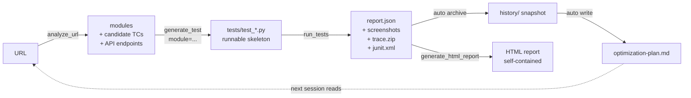

# MCP Test Runner

**English** · [繁體中文](README.zh-TW.md)

> Universal MCP server for running tests across pytest / Jest / Cypress / Go,
> with built-in DOM analyzer, run history, and a self-improvement coach.

A **Model Context Protocol** server that lets Claude Desktop / Cursor / any
MCP client drive your test suite end-to-end: run tests, inspect failures
(screenshot + video + trace), analyze a live URL to draft test cases, and —
after each run — produce a prioritized action plan telling you exactly what
to fix or write next.

| `QA_RUNNER` | Framework | Language |
|---|---|---|
| `pytest` / `pytest-playwright` / `playwright` | pytest + Playwright | Python |
| `jest` | Jest | JavaScript |
| `cypress` | Cypress | JavaScript |
| `go` / `go-test` | `go test` | Go |

Full design notes: [`framework.md`](framework.md).

---

## What's in the box

- **Run tests** across multiple frameworks via a single MCP surface
- **Failure artifacts**: screenshot (base64-inlined), video, Playwright trace.zip
- **Run history**: every run snapshotted; HTML report shows a sparkline trend
- **DOM analyzer** (`analyze_url`): opens a page → extracts forms / nav /
  dialogs / CTAs + the API endpoints it hits → emits candidate TC lists
- **Smart test generation** (`generate_test`): hand it an analyzer module and
  it writes a runnable Playwright skeleton with concrete selectors, not stubs
- **Auto-retry flakes** when `pytest-rerunfailures` is installed; flaky tests
  are surfaced separately from real failures
- **Self-improvement coach** (`get_optimization_plan`): post-run analysis
  across three lenses — suite quality, MCP usability, AI generation effectiveness
- **JUnit XML output** for CI integrations (GitHub Actions / Jenkins / GitLab)

---

## Install

```bash
python -m venv .venv
source .venv/bin/activate
pip install -e .
playwright install               # only if you use pytest-playwright
pip install pytest-rerunfailures # optional, enables auto-retry
```

## Wire into Claude Desktop

Copy `claude_desktop_config.example.json` to:

- **macOS**: `~/Library/Application Support/Claude/claude_desktop_config.json`
- **Windows**: `%APPDATA%\Claude\claude_desktop_config.json`

Two environment variables drive the runtime:

| Variable | Example | What it does |
|---|---|---|
| `QA_RUNNER` | `pytest` / `jest` / `cypress` / `go` | Selects which test framework |
| `QA_PROJECT_ROOT` | `/path/to/your/project` | Points at the project under test |

### Per-runner snippet

**pytest-playwright**:
```json
"env": { "QA_RUNNER": "pytest", "QA_PROJECT_ROOT": "/path/to/python-project" }
```

**Jest**:
```json
"env": { "QA_RUNNER": "jest", "QA_PROJECT_ROOT": "/path/to/node-project" }
```

**Cypress**:
```json
"env": { "QA_RUNNER": "cypress", "QA_PROJECT_ROOT": "/path/to/cypress-project" }
```

**Go test**:
```json
"env": { "QA_RUNNER": "go", "QA_PROJECT_ROOT": "/path/to/go-project" }
```

---

## Tool surface

Shared across all runners (some tools degrade gracefully on non-pytest runners):

| Tool | Purpose |
|---|---|
| `get_runner_info` | Which runner is active + all available ones |
| `list_tests` | Enumerate tests in the project |
| `run_tests` | Run tests (filter / headed / browser; last two pytest-playwright only) |
| `run_failed` | Re-run last failures (`pytest --lf`) |
| `get_test_report` | Summary (pass / fail / skipped / duration / flaky-in-run) |
| `get_failure_details` | Per-failure message + screenshot / trace / video paths |
| `generate_test` | Test skeleton; if `module` (from `analyze_url`) is provided, a *runnable* one |
| `codegen` | Launch Playwright codegen (pytest-playwright only) |
| `generate_html_report` | Render the latest run as self-contained HTML |
| `get_test_history` | Last N archived run summaries (for trend / flake debugging) |
| `analyze_url` | DOM probe → modules + selectors + candidate TCs + API endpoints |
| `get_optimization_plan` | Three-layer self-improvement coach (suite / MCP / AI strategy) |

### Resources

| URI | What |
|---|---|
| `report://html` | Live-rendered HTML report (dark mode, self-contained) |
| `report://json` | Raw pytest-json-report JSON |
| `report://optimization` | Latest `optimization-plan.md` |

---

## Self-improvement loop

After every run, `_archive_report()` snapshots `report.json` into
`test-results/history/` and writes a fresh `optimization-plan.md` covering:

1. **Suite quality** — outcomes string per test (`PFPFP`); transitions → flake
   score; 3+ identical-signature fails → broken; rerun-passed → flaky-in-run
2. **MCP usability** — top tools, error rates, repeat-arg patterns, common
   A→B chains (from telemetry JSONL logs)
3. **AI strategy** — adoption rate of `generate_test` outputs, coverage gaps
   from `analyze_url` modules with no matching test files

The plan emits prioritized actions (`high` / `medium` / `low`) each with
target + evidence + suggestion + optional `auto_action_hint` the MCP client
can chain into the next tool call.

---

## Project layout

```
mcp-test-runner/
├── pyproject.toml
├── src/mcp_test_runner/
│   ├── server.py            # MCP entry (tool routing + telemetry wrap)
│   ├── config.py            # Paths + env vars
│   ├── runners/             # Per-framework plugins
│   │   ├── base.py          # TestRunner abstract interface
│   │   ├── pytest_playwright.py
│   │   ├── jest.py
│   │   ├── cypress.py
│   │   └── go_test.py
│   ├── reporters/
│   │   └── html.py          # Self-contained HTML render
│   └── tools/               # Thin shims + analyzer + optimizer + telemetry
└── tests_project/           # Example project under test
```

---

## Adding a runner

1. Create `src/mcp_test_runner/runners/your_runner.py`, subclass `TestRunner`,
   implement the abstract methods
2. Register the name in `runners/__init__.py`'s `REGISTRY`
3. Done

---

## End-to-end workflow

The intended pipeline — from a URL to "what should I improve next time":



The loop is the point: every run feeds the optimizer, the optimizer
points at the weakest link, the next run hits that link first.

### Walkthrough — testing a login page

In a Claude / Cursor session:

> **You**: 分析 `https://shop.example/login`，幫我寫對應測試
>
> **Claude**: [`analyze_url`] Found 1 form (`email_password_form_0`) + 3 API
> endpoints. 5 candidate TCs.
> [`generate_test` with the form module] Wrote `tests/test_login.py` —
> runnable with concrete selectors, no `# TODO` stubs.

> **You**: 跑
>
> **Claude**: [`run_tests`] 23 passed, 0 failed in 31s. Screenshots + step
> traces captured for every test.

> **You**: 下一步該做什麼？
>
> **Claude**: [opens `report://optimization`]
> Top: `tests/test_login.py::test_invalid_credentials` is flaky
> (flake_score=0.4, outcomes=PFPFP). Suggestion: add
> `wait_for_response('/api/login')` before asserting the error message.

The three optimizer lenses (suite quality / MCP usability / AI generation
effectiveness) make every "下一步" answer data-driven, not gut feel.

---

## Prompting cookbook

Each row shows a phrase you can paste into a Claude / Cursor session and
the underlying MCP tool call it should trigger. Use as a reference for
"how do I get the AI to do X without naming the tool myself."

### One-time setup
| You say | Claude calls |
|---|---|
| "Initialize the QA knowledge file." | `init_qa_knowledge` → writes `qa-knowledge.md` to your project root |
| "Show me the current QA knowledge." | `get_qa_context` → methodology + your domain sections |
| "Open the ISTQB principles section." | `get_qa_context(section="ISTQB")` |

### Day-to-day testing
| You say | Claude calls |
|---|---|
| "Run all tests." | `run_tests` |
| "Run only login-related tests." | `run_tests(filter="login")` |
| "Re-run just the failures." | `run_failed` |
| "Show me the summary." | `get_test_report` |
| "Which ones failed? Give me screenshots and trace." | `get_failure_details` |
| "Generate the HTML report." | `generate_html_report` |

### Building tests from a URL
| You say | Claude calls |
|---|---|
| "Auto-generate tests for `https://shop.example/`." | `auto_generate_tests(url=...)` — one-shot |
| "Analyze `https://shop.example/coupon` first, then write one test per module." | `analyze_url` → `generate_test` × N |
| "Analyze coupon page and write a regression test for our past idempotency bug." | `get_qa_context(section="Bug")` → `analyze_url` → `generate_test(business_context=...)` |
| "Just record a checkout flow as a baseline." | `codegen(url=...)` |

### Continuous improvement
| You say | Claude calls |
|---|---|
| "What should I fix next?" | `get_optimization_plan` |
| "Has `test_login_invalid` been flaky lately?" | `get_test_history` + plan lookup |
| "Why did it fail? Show me the trace." | `get_failure_details` (returns screenshot/trace/video paths) |

### Tips — getting Claude to pick the right tool

- **Mention QA knowledge explicitly** — "**reference qa knowledge** when testing coupon" pushes Claude to call `get_qa_context` first; saying just "test coupon" may skip it.
- **State the order** — "**analyze first**, then write" forces `analyze_url` before `generate_test`; "just write a test for X" skips analysis.
- **Batch vs precise** — "auto-generate the whole page" → `auto_generate_tests`; "write one test per candidate_tc" → manual chain.
- **Failure debugging** — Asking "why did it fail / show me the screenshot" reliably triggers `get_failure_details` (which now returns screenshot + trace + video paths).

### Anti-patterns
- ❌ "Run it 5 times to see if it's flaky" — the runner has auto-retry + history; just ask "is it flaky" and let `get_optimization_plan` answer.
- ❌ "Generate 100 tests" — noise > signal. Use `get_optimization_plan` first to find what's missing.
- ❌ "Test all edge cases" — too vague. Phrase as "test every `candidate_tc` for this form" — concrete, bounded, traceable.

---

## Sample outputs

### `analyze_url` (excerpt)

```json
{
  "url": "https://shop.example/login",
  "page_title": "Login",
  "module_count": 3,
  "modules": [
    {
      "kind": "form",
      "name": "email_password_form_0",
      "selectors": {
        "container": "#login",
        "fields": [
          {"label": "Email", "selector": "#email", "type": "email", "required": true},
          {"label": "Password", "selector": "#password", "type": "password", "required": true}
        ],
        "submit": "button[type='submit']"
      },
      "candidate_tcs": [
        "所有必填欄位為空時送出，應顯示必填錯誤",
        "Email 欄位填入格式錯誤的字串（無 @），應顯示格式錯誤",
        "Password 欄位輸入後應預設遮蔽（type=password）",
        "全部填入合法值後送出，應觸發成功流程"
      ]
    }
  ],
  "api_endpoints": [
    {
      "method": "POST",
      "path": "/api/login",
      "status": 401,
      "candidate_tcs": [
        "POST /api/login payload 缺必填欄位應回 400 + 欄位錯誤訊息",
        "POST /api/login 合法 payload 應回 2xx",
        "POST /api/login 缺少 auth header 應回 401/403"
      ]
    }
  ]
}
```

### `generate_test` output (smart, with module)

```python
"""
Login happy path

Auto-generated from analyze_url module: email_password_form_0 (kind=form)
"""
from playwright.sync_api import Page, expect


def test_login(page: Page):
    page.goto('https://shop.example/login')
    page.locator('#email').fill('test@example.com')
    page.locator('#password').fill('TestPass123!')
    page.locator("button[type='submit']").click()
    # TC: Email 欄位填入格式錯誤的字串（無 @），應顯示格式錯誤
    # TC: Password 欄位輸入後應預設遮蔽
    # TC: 正確 Email + 正確密碼 → 導向 dashboard
    # TODO: 補上實際斷言，例如：
    # expect(page).to_have_url(...)
    # expect(page.get_by_text("成功")).to_be_visible()
```

### `optimization-plan.md` (excerpt)

```markdown
# Optimization Plan — 2026-05-12T14:03:40

_Based on 6 archived runs._

## Prioritized Actions

### 1. 🔴 HIGH — flaky
- **Target**: `tests/test_login.py::test_invalid_credentials`
- **Evidence**: flake_score=0.4, outcomes=PFPFP, rerun_count=1
- **Suggestion**: 加 explicit wait（wait_for_response / locator wait）

### 2. 🟡 MEDIUM — coverage_gap
- **Target**: `register_form`
- **Evidence**: 由 analyze_url 偵測但 repo 內找不到對應 test_*.py
- **Suggestion**: `call generate_test(description="...", filename="test_register_form.py")`
```

### HTML report

[**Open the live rendered demo →**](https://kao273183.github.io/mcp-test-runner/sample_report.html)
(served via GitHub Pages — clicking the link in GitHub's UI to
[`sample_report.html`](sample_report.html) would only show source).

The demo shows the stats grid, trend sparkline, failure cards with embedded
screenshots + step lists, and the collapsed Passed section.

---

## License

MIT © Jack Kao
