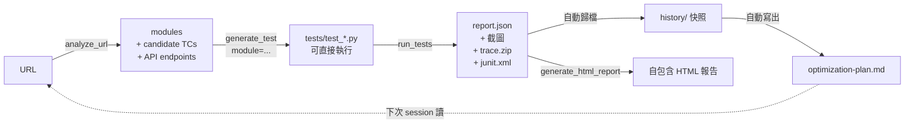

# MCP Test Runner

[English](README.md) · **繁體中文**

> 跨 pytest / Jest / Cypress / Go 的通用測試執行 MCP server，內建 DOM 分析器、執行歷史紀錄、與自我強化教練。

一個基於 **Model Context Protocol** 的伺服器，讓 Claude Desktop / Cursor / 任何 MCP client 端到端驅動你的測試流程：執行測試、檢視失敗（截圖 + 影片 + Playwright trace）、分析一個 URL 自動產生候選測試案例，並在每次跑完後吐出一份**下一輪該優化什麼**的優先級行動清單。

| `QA_RUNNER` | 框架 | 語言 |
|---|---|---|
| `pytest` / `pytest-playwright` / `playwright` | pytest + Playwright | Python |
| `jest` | Jest | JavaScript |
| `cypress` | Cypress | JavaScript |
| `go` / `go-test` | `go test` | Go |

完整設計文件：[`framework.md`](framework.md)。

---

## 功能總覽

- **跨框架執行測試**，單一 MCP 介面對接所有 runner
- **失敗產物完整**：截圖（base64 內嵌）、影片、Playwright trace.zip
- **執行歷史**：每次 run 自動快照；HTML 報告含 sparkline 趨勢線
- **DOM 分析器**（`analyze_url`）：開啟頁面 → 抽出 form / nav / dialog / CTA + 該頁載入時打的 API endpoints → 輸出候選 TC 清單
- **智慧測試生成**（`generate_test`）：餵 analyzer 拆出來的 module，產出**可直接執行**的 Playwright 骨架（不再是 `# TODO` 占位）
- **自動 retry flaky tests**（裝了 `pytest-rerunfailures` 時啟用）；retry 才 pass 的測試會單獨列為 flaky，不混入真實失敗
- **自我強化教練**（`get_optimization_plan`）：每次 run 結束後三層分析 — 測試套件品質、MCP 使用模式、AI 生成效益
- **JUnit XML 輸出**，CI 直接吃（GitHub Actions / Jenkins / GitLab）

---

## 安裝

```bash
python -m venv .venv
source .venv/bin/activate
pip install -e .
playwright install               # 用 pytest-playwright 才需要
pip install pytest-rerunfailures # 選用，啟用自動 retry
```

## 接到 Claude Desktop

複製 `claude_desktop_config.example.json` 內容到：

- **macOS**：`~/Library/Application Support/Claude/claude_desktop_config.json`
- **Windows**：`%APPDATA%\Claude\claude_desktop_config.json`

兩個關鍵環境變數：

| 變數 | 範例 | 作用 |
|---|---|---|
| `QA_RUNNER` | `pytest` / `jest` / `cypress` / `go` | 選擇測試框架 |
| `QA_PROJECT_ROOT` | `/path/to/your/project` | 指向受測專案根目錄 |

### 各 runner 設定範例

**pytest-playwright**：
```json
"env": { "QA_RUNNER": "pytest", "QA_PROJECT_ROOT": "/path/to/python-project" }
```

**Jest**：
```json
"env": { "QA_RUNNER": "jest", "QA_PROJECT_ROOT": "/path/to/node-project" }
```

**Cypress**：
```json
"env": { "QA_RUNNER": "cypress", "QA_PROJECT_ROOT": "/path/to/cypress-project" }
```

**Go test**：
```json
"env": { "QA_RUNNER": "go", "QA_PROJECT_ROOT": "/path/to/go-project" }
```

---

## Tool 清單

所有 runner 共用同一組（部分 tool 在非 pytest runner 上會 graceful 降級）：

| Tool | 用途 |
|---|---|
| `get_runner_info` | 看目前用哪個 runner、有哪些可用 |
| `list_tests` | 列出受測專案內所有測試 |
| `run_tests` | 執行測試（filter / headed / browser；後兩者只 pytest-playwright 用） |
| `run_failed` | 重跑上次失敗（`pytest --lf`） |
| `get_test_report` | 摘要（pass / fail / skipped / duration / flaky-in-run） |
| `get_failure_details` | 失敗詳情 + 對應的 screenshot / trace / video 路徑 |
| `generate_test` | 產生測試骨架；若提供 `module`（來自 `analyze_url`）則生成「可直接跑」的版本 |
| `codegen` | 啟動 Playwright codegen（只 pytest-playwright 支援） |
| `generate_html_report` | 把最近一次測試結果渲染成自包含 HTML |
| `get_test_history` | 最近 N 次 run 摘要（看 flake 與趨勢） |
| `analyze_url` | DOM 探測 → modules + selectors + candidate TCs + API endpoints |
| `get_optimization_plan` | 三層自我強化教練（測試品質 / MCP 使用 / AI 策略） |

### Resources

| URI | 內容 |
|---|---|
| `report://html` | 即時渲染的 HTML 報告（深色模式、自包含） |
| `report://json` | 原始 pytest-json-report JSON |
| `report://optimization` | 最新的 `optimization-plan.md`（自我強化行動清單） |

---

## 自我強化迴圈

每次 run 結束後，`_archive_report()` 會把 `report.json` 快照進 `test-results/history/`，並寫一份新的 `optimization-plan.md`，涵蓋三個視角：

1. **測試套件品質** — 每條 test 的歷史 outcome 字串（`PFPFP`）→ transition density 算 flake score；連 3 次失敗且 error signature 相同 → broken；retry 才 pass → flaky-in-run
2. **MCP 使用模式** — 從 telemetry JSONL 算出高頻 tool、錯誤率、重複 args 模式、常見鏈（A→B 連續呼叫）
3. **AI 產測策略** — `generate_test` 寫出的測試有沒有真的進到下次 run（採用率）；`analyze_url` 偵測到的 module 有沒有對應的測試檔（覆蓋缺口）

行動清單會排優先級（`high` / `medium` / `low`），每條附 target + evidence + suggestion，可選帶 `auto_action_hint` 給 MCP client 直接串到下一個 tool call。

---

## 專案結構

```
mcp-test-runner/
├── pyproject.toml
├── src/mcp_test_runner/
│   ├── server.py            # MCP 入口（tool 路由 + telemetry 包裝）
│   ├── config.py            # 路徑與環境變數
│   ├── runners/             # 各框架的 plugin
│   │   ├── base.py          # TestRunner 抽象介面
│   │   ├── pytest_playwright.py
│   │   ├── jest.py
│   │   ├── cypress.py
│   │   └── go_test.py
│   ├── reporters/
│   │   └── html.py          # 自包含 HTML 渲染
│   └── tools/               # 薄層 shim + analyzer + optimizer + telemetry
└── tests_project/           # 受測專案範例（pytest+playwright）
```

---

## 新增一個 runner

1. 在 `src/mcp_test_runner/runners/` 新增 `your_runner.py`，繼承 `TestRunner`，實作必要的 abstract method
2. 在 `runners/__init__.py` 的 `REGISTRY` 註冊名稱
3. 完成 ✅

---

## 端到端流程

從一個 URL 一路接到「下一輪該優化什麼」的完整 pipeline：



這個迴圈是設計重點：每次 run 餵 optimizer、optimizer 指出最弱的環節、下一次 run 優先攻那一環。

### Walkthrough — 從零測試一個登入頁

在 Claude / Cursor session 裡：

> **你**：分析 `https://shop.example/login`，幫我寫對應測試
>
> **Claude**：[`analyze_url`] 找到 1 個 form (`email_password_form_0`) + 3 個 API endpoints，候選 TC 5 條。
> [`generate_test` 帶該 form module] 寫了 `tests/test_login.py`，含真實 selectors、不再是 `# TODO` 占位。

> **你**：跑
>
> **Claude**：[`run_tests`] 23 passed、0 failed、31 秒。每條 test 的截圖 + step trace 都有。

> **你**：下一步該做什麼？
>
> **Claude**：[讀 `report://optimization`]
> 最高優先：`tests/test_login.py::test_invalid_credentials` flaky（flake_score=0.4, outcomes=PFPFP）。建議在斷言錯誤訊息前加 `wait_for_response('/api/login')`。

optimizer 三層（測試品質 / MCP 使用 / AI 產測效益）讓「下一步」永遠有資料佐證，不是憑感覺。

---

## 怎麼對 Claude 下指令（Prompting cookbook）

每列：你可以直接貼進 Claude / Cursor session 的中文 prompt → 對應的 MCP tool 呼叫。
不需要你自己 call tool 名稱，用自然語言觸發即可。

### 一次性設定
| 你說 | Claude 做 |
|---|---|
| 「初始化 QA 知識檔」 | `init_qa_knowledge` → 在受測專案根建立 `qa-knowledge.md` |
| 「看一下目前的 QA 知識」 | `get_qa_context` → 方法論 + 你的領域內容 |
| 「載入 ISTQB 原則那段」 | `get_qa_context(section="ISTQB")` |

### 日常跑測試
| 你說 | Claude 做 |
|---|---|
| 「跑所有測試」 | `run_tests` |
| 「只跑 login 相關」 | `run_tests(filter="login")` |
| 「重跑剛剛失敗的」 | `run_failed` |
| 「看一下結果摘要」 | `get_test_report` |
| 「哪幾個失敗了、給我截圖跟 trace」 | `get_failure_details` |
| 「產一份 HTML 報告」 | `generate_html_report` |

### 從零測一個 URL（最有戲的玩法）
| 你說 | Claude 做 |
|---|---|
| 「測試 `https://shop.example/` 的所有模塊」 | `auto_generate_tests` 一鍵交付 |
| 「先分析 `https://shop.example/coupon`、再對每個模塊各寫 1 條測試」 | `analyze_url` → 對每個 module 一次 `generate_test` |
| 「分析 coupon 頁、**參考歷史 bug** 寫回歸測試」 | `get_qa_context(section="歷史 Bug")` → `analyze_url` → `generate_test(business_context=...)` |
| 「幫我錄結帳流程當 baseline」 | `codegen(url=...)` 開瀏覽器讓你錄 |

### 持續優化（self-improvement loop）
| 你說 | Claude 做 |
|---|---|
| 「下一步該優化什麼？」 | `get_optimization_plan` → 排序行動清單 |
| 「最近 5 次 `test_login` 怎樣？」 | `get_test_history` + plan lookup |
| 「`test_invalid_pwd` 為什麼 flaky？」 | `get_failure_details` + 看評分 |

### Tips：怎麼讓 Claude 選對工具

- **明示用 QA 知識** — 「**參考 qa 知識**測 coupon」會引導 Claude call `get_qa_context`；不提就會跳過、直接 generate。
- **明示分析步驟** — 「**先分析**再寫」走 `analyze_url`；「直接寫一個」跳過分析。
- **批次 vs 精挑** — 「一鍵」對應 `auto_generate_tests`；「對每個模塊一條」對應分步 `generate_test`。
- **失敗除錯** — 直接問「為什麼失敗 / 給我截圖」會走 `get_failure_details`，回傳 screenshot/trace/video 路徑。

### Anti-patterns（不該這樣下指令）

- ❌ 「跑 5 次來判斷 flaky」— runner 已有 `--reruns 1` auto-retry + history 紀錄，直接問「有沒有 flaky」用 `get_optimization_plan` 就回得出來。
- ❌ 「一次產 100 條 test」— noise > signal。先用 `get_optimization_plan` 找最該補的，再針對性產測。
- ❌ 「測試所有邊界」太空泛 — 改成「測這個 form 的所有 candidate_tcs」更具體可追蹤。

---

## 範本輸出

### `analyze_url` 結果（節錄）

```json
{
  "url": "https://shop.example/login",
  "page_title": "Login",
  "module_count": 3,
  "modules": [
    {
      "kind": "form",
      "name": "email_password_form_0",
      "selectors": {
        "container": "#login",
        "fields": [
          {"label": "Email", "selector": "#email", "type": "email", "required": true},
          {"label": "Password", "selector": "#password", "type": "password", "required": true}
        ],
        "submit": "button[type='submit']"
      },
      "candidate_tcs": [
        "所有必填欄位為空時送出，應顯示必填錯誤",
        "Email 欄位填入格式錯誤的字串（無 @），應顯示格式錯誤",
        "Password 欄位輸入後應預設遮蔽（type=password）",
        "全部填入合法值後送出，應觸發成功流程"
      ]
    }
  ],
  "api_endpoints": [
    {
      "method": "POST",
      "path": "/api/login",
      "status": 401,
      "candidate_tcs": [
        "POST /api/login payload 缺必填欄位應回 400 + 欄位錯誤訊息",
        "POST /api/login 合法 payload 應回 2xx",
        "POST /api/login 缺少 auth header 應回 401/403"
      ]
    }
  ]
}
```

### `generate_test` 輸出（智慧模式、帶 module）

```python
"""
Login happy path

Auto-generated from analyze_url module: email_password_form_0 (kind=form)
"""
from playwright.sync_api import Page, expect


def test_login(page: Page):
    page.goto('https://shop.example/login')
    page.locator('#email').fill('test@example.com')
    page.locator('#password').fill('TestPass123!')
    page.locator("button[type='submit']").click()
    # TC: Email 欄位填入格式錯誤的字串（無 @），應顯示格式錯誤
    # TC: Password 欄位輸入後應預設遮蔽
    # TC: 正確 Email + 正確密碼 → 導向 dashboard
    # TODO: 補上實際斷言，例如：
    # expect(page).to_have_url(...)
    # expect(page.get_by_text("成功")).to_be_visible()
```

### `optimization-plan.md`（節錄）

```markdown
# Optimization Plan — 2026-05-12T14:03:40

_Based on 6 archived runs._

## Prioritized Actions

### 1. 🔴 HIGH — flaky
- **Target**: `tests/test_login.py::test_invalid_credentials`
- **Evidence**: flake_score=0.4, outcomes=PFPFP, rerun_count=1
- **Suggestion**: 加 explicit wait（wait_for_response / locator wait）

### 2. 🟡 MEDIUM — coverage_gap
- **Target**: `register_form`
- **Evidence**: 由 analyze_url 偵測但 repo 內找不到對應 test_*.py
- **Suggestion**: `call generate_test(description="...", filename="test_register_form.py")`
```

### HTML 報告

[**直接看實際渲染 →**](https://kao273183.github.io/mcp-test-runner/sample_report.html)
（透過 GitHub Pages；點 GitHub UI 裡的 [`sample_report.html`](sample_report.html) 只會看到原始碼）。

實際渲染內容含統計卡、Trend sparkline、失敗卡片（嵌入截圖 + step list）、折疊的 Passed 區塊。

---

## License

MIT © Jack Kao
