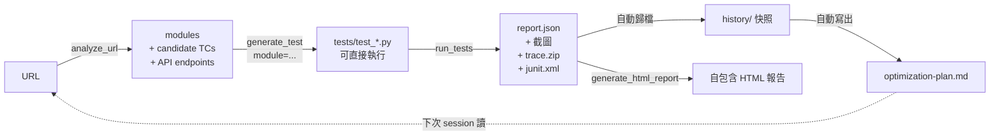

<p align="center">
  
</p>

<h1 align="center">AI 測試大師 ｜ MK QA Master</h1>

<p align="center">
  <em>你的 AI QA 全鏈路工具 — 分析、生成、執行、給建議。</em>
</p>

<p align="center">
  <a href="README.md">English</a> · <strong>繁體中文</strong>
</p>

<p align="center">
  <a href="https://pypi.org/project/mk-qa-master/"></a>
  <a href="LICENSE"></a>
  <a href="https://www.buymeacoffee.com/minikao"></a>
</p>

> 跨 pytest / Jest / Cypress / Go 的通用測試執行 MCP server，內建 DOM 分析器、執行歷史紀錄、與自我強化教練。

一個基於 **Model Context Protocol** 的伺服器，讓 Claude Desktop / Cursor / 任何 MCP client 端到端驅動你的測試流程：執行測試、檢視失敗（截圖 + 影片 + Playwright trace）、分析一個 URL 自動產生候選測試案例，並在每次跑完後吐出一份**下一輪該優化什麼**的優先級行動清單。

| `QA_RUNNER` | 框架 | 語言 | 目標 |
|---|---|---|---|
| `pytest` / `pytest-playwright` / `playwright` | pytest + Playwright | Python | Web |
| `jest` | Jest | JavaScript | Web |
| `cypress` | Cypress | JavaScript | Web |
| `go` / `go-test` | `go test` | Go | Backend |
| `maestro` / `mobile` | Maestro | YAML | iOS + Android |
| `schemathesis` / `api` | Schemathesis | OpenAPI 3.x / Swagger 2.0 | API（v0.6.0 起） |
| `newman` / `postman` | Newman | Postman collection v2.x | API（v0.6.1 起） |

完整設計文件：[`docs/framework.md`](docs/framework.md)。

---

## 功能總覽

- **跨框架執行測試**（web + mobile + API），單一 MCP 介面對接所有 runner
- **行動端透過 Maestro**（v0.3.0 起）：同樣 MCP tool 集、iOS Simulator / Android Emulator / 真機都通；YAML flow 跨平台共用
- **原生 API 測試 — 兩個 runner**（v0.6.0 / v0.6.1 起）：API 測試這格目前並列兩個 runner，各自吃你團隊已經在維護的 artifact。
  - **Schemathesis**（`QA_RUNNER=schemathesis`，v0.6.0 起）：餵 runner 一個 OpenAPI 3.x / Swagger 2.0 URL 或 `file://` schema，自動產生 property-based fuzz 測試案例，涵蓋 status code、response schema、content-type、`5xx` 受 fuzz 影響等檢查。
  - **Newman**（`QA_RUNNER=newman`，v0.6.1 起）：餵 runner 一個 Postman 2.x 匯出的 collection（可選帶 environment / globals），Newman 會 replay 每個 request、執行內嵌的 `pm.test(...)` assertion，每個 assertion 對應一個 mk-qa-master nodeid。**Newman 是系統依賴**（`npm install -g newman`）—— 它是 npm 套件不是 pip，所以沒有 Python extra 可裝。

  兩個 runner 都沿用同一套 MCP tool surface，且共用 `report.json` / history / flake / optimizer pipeline。已經用 pytest+`httpx`、Jest+`supertest`、Cypress `cy.request()`、Go `net/http/httptest` 寫好的 API 測試**仍然走原本的 runner，不需要遷移**。Pact provider verification 維持在 v0.7.0 條件式 roadmap。
- **失敗產物完整**：截圖（base64 內嵌）、影片、Playwright trace.zip / Maestro recording
- **執行歷史**：每次 run 自動快照；HTML 報告含 sparkline 趨勢線
- **DOM / Screen 分析器** — `analyze_url`（web，抓 form / nav / dialog / CTA + 該頁打的 API + 跑版偵測）跟 `analyze_screen`（mobile，透過 `maestro hierarchy` 抓 form / cta / tab_bar）
- **智慧測試生成**（`generate_test`）：餵 analyzer 拆出來的 module，產出**可直接執行**的 Playwright `.py` 或 Maestro `.yaml`（不再是 `# TODO` 占位）
- **自動 retry flaky tests** — pytest 端透過 `pytest-rerunfailures`、Maestro 端透過自寫 retry wrapper（Maestro 沒原生 `--reruns`）；retry 才 pass 的測試會單獨列為 flaky
- **自我強化教練**（`get_optimization_plan`）：每次 run 結束後三層分析 — 測試套件品質、MCP 使用模式、AI 生成效益
- **JUnit XML 輸出**，CI 直接吃（GitHub Actions / Jenkins / GitLab）

---

## 安裝

兩條路線，看你怎麼用：

### A. 用 `uvx` 跑（零安裝，推薦給一般使用者）

在 client config 加 `mk-qa-master`，不用全域裝任何東西；[`uv`](https://docs.astral.sh/uv/) 會每次幫你抓並在隔離環境跑：

```json
{
  "mcpServers": {
    "mk-qa-master": {
      "command": "uvx",
      "args": ["mk-qa-master"],
      "env": { "QA_RUNNER": "pytest", "QA_PROJECT_ROOT": "/path/to/your-test-project" }
    }
  }
}
```

整個設定就這樣。第一次呼叫會下載，後續走 cache。要指定版本：`uvx mk-qa-master@0.4.1 ...`。

### B. 裝進自己的 venv（給貢獻者 / 想 hack 的人）

```bash
pip install mk-qa-master       # 或 git clone 後 pip install -e .
playwright install                # pytest-playwright 才需要
pip install pytest-rerunfailures  # 選用，啟用自動 retry
```

client config 指向同一個 Python：

```json
"command": "/path/to/.venv/bin/python",
"args": ["-m", "mk_qa_master.server"]
```

### 各 runner 的先決條件

| `QA_RUNNER` | 還要先裝 |
|---|---|
| `pytest` / `pytest-playwright` | `pip install pytest-playwright` + `playwright install chromium` |
| `jest` | Node 專案 + `npm i -D jest` |
| `cypress` | Node 專案 + `npm i -D cypress` |
| `go` | Go toolchain 在 PATH |
| `maestro` | [Maestro CLI](https://maestro.mobile.dev/) + 模擬器 / 實機 / BlueStacks（透過 `adb connect`） |
| `schemathesis` / `api` | `pip install 'mk-qa-master[api]'`（自動拉 `schemathesis>=3.0,<4`） |
| `newman` / `postman` | `npm install -g newman`（Newman 是 npm 套件，不是 pip——沒有 extra 要裝） |


## API 測試（`QA_RUNNER=schemathesis`）

把 runner 指向任何 OpenAPI 3.x / Swagger 2.0 schema，Schemathesis 就會 per
operation 產生 property-based 測試案例 — 涵蓋 response schema conformance、
status code conformance、content-type 檢查、被 fuzz 打到 `5xx` 的情況。
結果跟 UI 測試走同一條 `report.json` / history / flake / optimizer pipeline。

端到端教學：[`docs/walkthrough-api.md`](docs/walkthrough-api.md)。
3 endpoint 範例 schema：[`examples/sample_api_project/`](examples/sample_api_project/)。

### 5 行設定

```jsonc
"env": {
  "QA_RUNNER": "schemathesis",
  "QA_OPENAPI_URL": "https://api.example.com/openapi.json"
}
```

### 環境變數

| 變數 | 必填 | 預設 | 作用 |
|---|---|---|---|
| `QA_OPENAPI_URL` | 是 | — | OpenAPI 路徑。`http(s)://...` 或 `file://...`。**純檔案路徑不接受**——一律加 `file://` 前綴避免相對/絕對解析歧義。 |
| `QA_SCHEMATHESIS_CHECKS` | 否 | `all` | 逗號分隔子集：`response_schema_conformance,status_code_conformance,not_a_server_error,content_type_conformance,response_headers_conformance`。 |
| `QA_SCHEMATHESIS_AUTH` | 否 | — | Authorization header 值。以 `-H "Authorization: <value>"` 傳入；不會寫進 log，archived report 也會做敏感字串遮罩。 |
| `QA_SCHEMATHESIS_MAX_EXAMPLES` | 否 | `20` | 每個 operation 的 Hypothesis sample 數。越大 fuzz 越深、跑越久。 |
| `QA_SCHEMATHESIS_DRY_RUN` | 否 | `0` | 設 `1` 啟用「planning only、不打 HTTP」模式 — 對 production 做安全 preview、或 CI 只跑 schema-only smoke 時用。 |
| `QA_NO_REDACT` | 否 | `0` | 關閉 archived report 的敏感字串遮罩。預設遮罩 `Authorization: Bearer …`、`"password": …`、`"token" / "api_key" / "secret" / "access_token" / "refresh_token": …`。 |

原本的 `QA_TIMEOUT_SECONDS`（預設 600s）依然作用。


## API 測試（`QA_RUNNER=newman`）

把 runner 指向任何匯出的 Postman 2.x collection，Newman 6.x 會 replay 每個
request、執行內嵌的 `pm.test(...)` assertion，每個 assertion 變成一個
mk-qa-master nodeid。結果跟 Schemathesis、UI 測試共用同一條 `report.json` /
history / flake / optimizer pipeline。

**系統依賴**：Newman 是 npm 套件不是 pip，請先全域安裝：

```bash
npm install -g newman
```

沒有 `pip install 'mk-qa-master[postman]'` extra——runner 只是 shell out
到 PATH 上的 `newman` binary。沒裝會丟出明確的 `ImportError` 提示。

OpenAPI 範例對應的同一個 3-endpoint **Library API**，同時以 Postman
collection 形式收在
[`examples/sample_api_project/postman-collection.json`](examples/sample_api_project/postman-collection.json)。
配 `prism mock examples/sample_api_project/openapi.yaml` 起 mock server，
就能完全離線玩；或者指向你自家的 staging server。

### 5 行設定

```jsonc
"env": {
  "QA_RUNNER": "newman",
  "QA_POSTMAN_COLLECTION": "/absolute/path/to/your-collection.json"
}
```

### 環境變數

| 變數 | 必填 | 預設 | 作用 |
|---|---|---|---|
| `QA_POSTMAN_COLLECTION` | 是 | — | Postman 2.x collection JSON 的純檔案路徑。**不用 `file://` 前綴**——Newman 不需要 scheme 區分（collection 本來就只會在本機）。 |
| `QA_POSTMAN_ENVIRONMENT` | 否 | — | Postman environment 檔的純路徑（`-e <path>`）。提供 `{{var_name}}` placeholder 的值。 |
| `QA_POSTMAN_GLOBALS` | 否 | — | Postman globals 檔的純路徑（`-g <path>`）。同 environment shape，全域作用。 |
| `QA_POSTMAN_ITERATIONS` | 否 | `1` | 整個 collection replay 幾次（`-n <N>`），soak test 跟 flake 偵測時用。 |
| `QA_POSTMAN_FOLDER` | 否 | — | CSV 逗號分隔的 Postman folder 名稱，限縮這次 run 的範圍（重複的 `--folder` flag）。`run_failed` 也會用 folder-scoping 來重跑。 |
| `QA_POSTMAN_TIMEOUT_REQUEST_MS` | 否 | `30000` | 單一 request 的 HTTP timeout（毫秒，`--timeout-request`）。與 `QA_TIMEOUT_SECONDS`（整個 subprocess 的天花板）不衝突。 |
| `QA_NO_REDACT` | 否 | `0` | 與 Schemathesis runner 相同的遮罩政策——只在 short debug 時關掉。 |

原本的 `QA_TIMEOUT_SECONDS`（預設 600s）依然作用。


## 接到 Claude Desktop

複製 `examples/configs/claude_desktop_config.example.json` 內容到：

- **macOS**：`~/Library/Application Support/Claude/claude_desktop_config.json`
- **Windows**：`%APPDATA%\Claude\claude_desktop_config.json`

兩個關鍵環境變數：

| 變數 | 範例 | 作用 |
|---|---|---|
| `QA_RUNNER` | `pytest` / `jest` / `cypress` / `go` / `maestro` / `schemathesis` / `newman` | 選擇測試框架 |
| `QA_PROJECT_ROOT` | `/path/to/your/project` | 指向受測專案根目錄 |

### 各 runner 設定範例

**pytest-playwright**：
```json
"env": { "QA_RUNNER": "pytest", "QA_PROJECT_ROOT": "/path/to/python-project" }
```

**Jest**：
```json
"env": { "QA_RUNNER": "jest", "QA_PROJECT_ROOT": "/path/to/node-project" }
```

**Cypress**：
```json
"env": { "QA_RUNNER": "cypress", "QA_PROJECT_ROOT": "/path/to/cypress-project" }
```

**Go test**：
```json
"env": { "QA_RUNNER": "go", "QA_PROJECT_ROOT": "/path/to/go-project" }
```

**Schemathesis（API）**：
```json
"env": {
  "QA_RUNNER": "schemathesis",
  "QA_OPENAPI_URL": "https://api.example.com/openapi.json"
}
```

**Newman（Postman）**：
```json
"env": {
  "QA_RUNNER": "newman",
  "QA_POSTMAN_COLLECTION": "/absolute/path/to/collection.json"
}
```

---

## 其他 MCP client（不只 Claude）

MCP 是開放協議 — 這個 server 不綁 Claude。同一個 Python process 用
JSON-RPC stdio 跟任何 MCP client 對話。各家差別在 (1) config 檔格式跟
(2) 底層 model 自動串接 tool 的可靠度。

| Client | Config 位置 | 格式 | Model | Tool 串接品質 |
|---|---|---|---|---|
| Claude Desktop / Cursor | `~/Library/Application Support/Claude/...json` · `~/.cursor/mcp.json` | JSON | Claude Opus / Sonnet | 主要測試對象 |
| **Codex CLI** | `~/.codex/config.toml` | **TOML** | GPT-5 系列 | 強（GPT-5 chain-of-tools 訓練深） |
| **Gemini CLI** | `~/.gemini/settings.json` | JSON | Gemini 3.1 Pro / Flash | 可用、但偏 reactive，prompt 越明示越好 |
| Cline / Continue / Zed | 各自的 MCP config slot | 不一 | 依設定的 model | 依底層 model |

Repo 內附三份範例：
[`codex-config.example.toml`](examples/configs/codex-config.example.toml) ·
[`gemini-config.example.json`](examples/configs/gemini-config.example.json) ·
[`claude_desktop_config.example.json`](examples/configs/claude_desktop_config.example.json)。

**Codex（TOML）**：
```toml
[mcp_servers.mk-qa-master]
command = "/path/to/.venv/bin/python"
args = ["-m", "mk_qa_master.server"]
cwd = "/path/to/mk-qa-master"
[mcp_servers.mk-qa-master.env]
QA_RUNNER = "pytest"
QA_PROJECT_ROOT = "/path/to/your-test-project"
```

**Gemini（JSON，跟 Claude Desktop 結構幾乎一樣）**：
```json
{
  "mcpServers": {
    "mk-qa-master": {
      "command": "/path/to/.venv/bin/python",
      "args": ["-m", "mk_qa_master.server"],
      "cwd": "/path/to/mk-qa-master",
      "env": {
        "QA_RUNNER": "pytest",
        "QA_PROJECT_ROOT": "/path/to/your-test-project"
      }
    }
  }
}
```

我們 tool description 已經寫了推薦串接（`analyze_url → generate_test`、
`get_qa_context` 先於領域產測）。**tool-selection 偏弱的 client（如 Gemini）
靠明示「先 X 再 Y」的 prompt 效果最佳**；Claude / Codex 則對隱性串接判斷力強。

---

## Tool 清單

所有 runner 共用同一組（部分 tool 在非 pytest runner 上會 graceful 降級）：

| Tool | 用途 |
|---|---|
| `get_runner_info` | 看目前用哪個 runner、有哪些可用 |
| `list_tests` | 列出受測專案內所有測試 |
| `run_tests` | 執行測試（filter / headed / browser；後兩者只 pytest-playwright 用） |
| `run_failed` | 重跑上次失敗（`pytest --lf`） |
| `get_test_report` | 摘要（pass / fail / skipped / duration / flaky-in-run） |
| `get_failure_details` | 失敗詳情 + 對應的 screenshot / trace / video 路徑 |
| `generate_test` | 產生測試骨架；若提供 `module`（來自 `analyze_url`/`analyze_screen`）會產出「可直接跑」的 Playwright `.py` 或 Maestro `.yaml` |
| `auto_generate_tests` | 一鍵：analyze URL → 對每個 module 各產一條 test |
| `codegen` | 啟動 Playwright codegen（web）/ 指引 `maestro studio`（mobile） |
| `generate_html_report` | 把最近一次測試結果渲染成自包含 HTML |
| `get_test_history` | 最近 N 次 run 摘要（看 flake 與趨勢） |
| `analyze_url` | **Web**: DOM 探測 → modules + selectors + candidate TCs + API endpoints + 跑版偵測 |
| `analyze_screen` | **Mobile**: `maestro hierarchy` → form / cta / tab_bar modules + candidate TCs（噪音過濾過） |
| `init_qa_knowledge` / `get_qa_context` | 建立 + 讀取專案 QA 知識（內建方法論 + 你的領域） |
| `get_optimization_plan` | 三層自我強化教練（測試品質 / MCP 使用 / AI 策略） |

### Resources

| URI | 內容 |
|---|---|
| `report://html` | 即時渲染的 HTML 報告（深色模式、自包含） |
| `report://json` | 原始 pytest-json-report JSON |
| `report://optimization` | 最新的 `optimization-plan.md`（自我強化行動清單） |

---

## 自我強化迴圈

每次 run 結束後，`_archive_report()` 會把 `report.json` 快照進 `test-results/history/`，並寫一份新的 `optimization-plan.md`，涵蓋三個視角：

1. **測試套件品質** — 每條 test 的歷史 outcome 字串（`PFPFP`）→ transition density 算 flake score；連 3 次失敗且 error signature 相同 → broken；retry 才 pass → flaky-in-run
2. **MCP 使用模式** — 從 telemetry JSONL 算出高頻 tool、錯誤率、重複 args 模式、常見鏈（A→B 連續呼叫）
3. **AI 產測策略** — `generate_test` 寫出的測試有沒有真的進到下次 run（採用率）；`analyze_url` 偵測到的 module 有沒有對應的測試檔（覆蓋缺口）

行動清單會排優先級（`high` / `medium` / `low`），每條附 target + evidence + suggestion，可選帶 `auto_action_hint` 給 MCP client 直接串到下一個 tool call。

---

## 專案結構

```
mk-qa-master/
├── pyproject.toml
├── src/mk_qa_master/
│   ├── server.py            # MCP 入口（tool 路由 + telemetry 包裝）
│   ├── config.py            # 路徑與環境變數
│   ├── runners/             # 各框架的 plugin
│   │   ├── base.py          # TestRunner 抽象介面
│   │   ├── pytest_playwright.py
│   │   ├── jest.py
│   │   ├── cypress.py
│   │   └── go_test.py
│   ├── reporters/
│   │   └── html.py          # 自包含 HTML 渲染
│   └── tools/               # 薄層 shim + analyzer + optimizer + telemetry
└── tests_project/           # 受測專案範例（pytest+playwright）
```

---

## 新增一個 runner

1. 在 `src/mk_qa_master/runners/` 新增 `your_runner.py`，繼承 `TestRunner`，實作必要的 abstract method
2. 在 `runners/__init__.py` 的 `REGISTRY` 註冊名稱
3. 完成 ✅

---

## 端到端流程

從一個 URL 一路接到「下一輪該優化什麼」的完整 pipeline：



這個迴圈是設計重點：每次 run 餵 optimizer、optimizer 指出最弱的環節、下一次 run 優先攻那一環。

### Walkthrough — 從零測試一個登入頁

在 Claude / Cursor session 裡：

> **你**：分析 `https://shop.example/login`，幫我寫對應測試
>
> **Claude**：[`analyze_url`] 找到 1 個 form (`email_password_form_0`) + 3 個 API endpoints，候選 TC 5 條。
> [`generate_test` 帶該 form module] 寫了 `tests/test_login.py`，含真實 selectors、不再是 `# TODO` 占位。

> **你**：跑
>
> **Claude**：[`run_tests`] 23 passed、0 failed、31 秒。每條 test 的截圖 + step trace 都有。

> **你**：下一步該做什麼？
>
> **Claude**：[讀 `report://optimization`]
> 最高優先：`tests/test_login.py::test_invalid_credentials` flaky（flake_score=0.4, outcomes=PFPFP）。建議在斷言錯誤訊息前加 `wait_for_response('/api/login')`。

optimizer 三層（測試品質 / MCP 使用 / AI 產測效益）讓「下一步」永遠有資料佐證，不是憑感覺。

### Walkthrough — 測試手機 App（Maestro）

同一個 shape、換 runner。前提：Maestro CLI 已裝、simulator/emulator booted、App 已開（或傳 `launch_app=true` + `app_id` 自動啟動）：

> **你**：分析 你的 App 首頁的條碼按鈕、寫對應測試
>
> **Claude**：[`analyze_screen`(app_id="com.example.app", launch_app=true)]
> 找到 15 個可互動元素，其中 `barcode_button`（text="條碼"、resource_id="barcodeButton"）+ 候選 TC。
> [`generate_test` 帶該 cta module] 寫了 `maestro-flows/test_barcode.yaml`：
> `tapOn: { id: barcodeButton }` + waitForAnimationToEnd + takeScreenshot，可直接 `maestro test`。

> **你**：跑
>
> **Claude**：[`run_tests`] 5 個 flow 全 pass、retry 沒觸發。HTML 報告已含截圖。

> **你**：剛剛這個按鈕有時候會 fail、為什麼？
>
> **Claude**：[`get_optimization_plan`] `barcode_button::barcode_button` 標 flaky（flake_score=0.4、outcomes=PFPFP、rerun_count=1）。建議加 `waitForAnimationToEnd` 或 `extendedWaitUntil` 等動畫穩定後再 tap。

行動端特別注意：
- 同一份 `qa-knowledge.md`（內建方法論 + 你的領域）web / mobile 共用 — 業務規則只寫一次
- `analyze_screen` 自動過濾 iOS 狀態列（訊號 / Wi-Fi / 電池）跟 asset 名稱（`bg_*`、`*_filled`）
- Maestro 的 `takeScreenshot: <name>` 指令控制哪些畫面會嵌進 HTML 報告

---

## 怎麼對 Claude 下指令（Prompting cookbook）

每列：你可以直接貼進 Claude / Cursor session 的中文 prompt → 對應的 MCP tool 呼叫。
不需要你自己 call tool 名稱，用自然語言觸發即可。

### 一次性設定
| 你說 | Claude 做 |
|---|---|
| 「初始化 QA 知識檔」 | `init_qa_knowledge` → 在受測專案根建立 `qa-knowledge.md` |
| 「看一下目前的 QA 知識」 | `get_qa_context` → 方法論 + 你的領域內容 |
| 「載入 ISTQB 原則那段」 | `get_qa_context(section="ISTQB")` |

### 日常跑測試
| 你說 | Claude 做 |
|---|---|
| 「跑所有測試」 | `run_tests` |
| 「只跑 login 相關」 | `run_tests(filter="login")` |
| 「重跑剛剛失敗的」 | `run_failed` |
| 「看一下結果摘要」 | `get_test_report` |
| 「哪幾個失敗了、給我截圖跟 trace」 | `get_failure_details` |
| 「產一份 HTML 報告」 | `generate_html_report` |

### 從零測一個 URL（web）
| 你說 | Claude 做 |
|---|---|
| 「測試 `https://shop.example/` 的所有模塊」 | `auto_generate_tests` 一鍵交付 |
| 「先分析 `https://shop.example/coupon`、再對每個模塊各寫 1 條測試」 | `analyze_url` → 對每個 module 一次 `generate_test` |
| 「分析 coupon 頁、**參考歷史 bug** 寫回歸測試」 | `get_qa_context(section="歷史 Bug")` → `analyze_url` → `generate_test(business_context=...)` |
| 「幫我錄結帳流程當 baseline」 | `codegen(url=...)` 開瀏覽器讓你錄 |

### 從手機 App 畫面寫測試（Maestro）
需要 `QA_RUNNER=maestro`、Maestro CLI、且 simulator/emulator/真機 booted。

| 你說 | Claude 做 |
|---|---|
| 「分析 你的 App 現在的畫面、寫條碼按鈕的測試」 | `analyze_screen(app_id="com.example.app", launch_app=true)` → `generate_test(module=<cta>)` |
| 「測這個 app 的登入表單」 | `analyze_screen(launch_app=true)` → 挑 `form` module → `generate_test` |
| 「Tab bar 全測一遍、每個 tab 一條 flow」 | `analyze_screen` → 拿 `tab_bar` module → `generate_test` |
| 「用 Maestro Studio 錄一個 flow」 | `codegen(url=...)` 會回提示叫你開 `maestro studio` 互動錄製、另存 |

### 持續優化（self-improvement loop）
| 你說 | Claude 做 |
|---|---|
| 「下一步該優化什麼？」 | `get_optimization_plan` → 排序行動清單 |
| 「最近 5 次 `test_login` 怎樣？」 | `get_test_history` + plan lookup |
| 「`test_invalid_pwd` 為什麼 flaky？」 | `get_failure_details` + 看評分 |

### Tips：怎麼讓 Claude 選對工具

- **明示用 QA 知識** — 「**參考 qa 知識**測 coupon」會引導 Claude call `get_qa_context`；不提就會跳過、直接 generate。
- **明示分析步驟** — 「**先分析**再寫」走 `analyze_url`；「直接寫一個」跳過分析。
- **批次 vs 精挑** — 「一鍵」對應 `auto_generate_tests`；「對每個模塊一條」對應分步 `generate_test`。
- **失敗除錯** — 直接問「為什麼失敗 / 給我截圖」會走 `get_failure_details`，回傳 screenshot/trace/video 路徑。

### Anti-patterns（不該這樣下指令）

- ❌ 「跑 5 次來判斷 flaky」— runner 已有 `--reruns 1` auto-retry + history 紀錄，直接問「有沒有 flaky」用 `get_optimization_plan` 就回得出來。
- ❌ 「一次產 100 條 test」— noise > signal。先用 `get_optimization_plan` 找最該補的，再針對性產測。
- ❌ 「測試所有邊界」太空泛 — 改成「測這個 form 的所有 candidate_tcs」更具體可追蹤。

---

## 範本輸出

### `analyze_url` 結果（節錄）

```json
{
  "url": "https://shop.example/login",
  "page_title": "Login",
  "module_count": 3,
  "modules": [
    {
      "kind": "form",
      "name": "email_password_form_0",
      "selectors": {
        "container": "#login",
        "fields": [
          {"label": "Email", "selector": "#email", "type": "email", "required": true},
          {"label": "Password", "selector": "#password", "type": "password", "required": true}
        ],
        "submit": "button[type='submit']"
      },
      "candidate_tcs": [
        "所有必填欄位為空時送出，應顯示必填錯誤",
        "Email 欄位填入格式錯誤的字串（無 @），應顯示格式錯誤",
        "Password 欄位輸入後應預設遮蔽（type=password）",
        "全部填入合法值後送出，應觸發成功流程"
      ]
    }
  ],
  "api_endpoints": [
    {
      "method": "POST",
      "path": "/api/login",
      "status": 401,
      "candidate_tcs": [
        "POST /api/login payload 缺必填欄位應回 400 + 欄位錯誤訊息",
        "POST /api/login 合法 payload 應回 2xx",
        "POST /api/login 缺少 auth header 應回 401/403"
      ]
    }
  ]
}
```

### `generate_test` 輸出（智慧模式、帶 module）

```python
"""
Login happy path

Auto-generated from analyze_url module: email_password_form_0 (kind=form)
"""
from playwright.sync_api import Page, expect


def test_login(page: Page):
    page.goto('https://shop.example/login')
    page.locator('#email').fill('test@example.com')
    page.locator('#password').fill('TestPass123!')
    page.locator("button[type='submit']").click()
    # TC: Email 欄位填入格式錯誤的字串（無 @），應顯示格式錯誤
    # TC: Password 欄位輸入後應預設遮蔽
    # TC: 正確 Email + 正確密碼 → 導向 dashboard
    # TODO: 補上實際斷言，例如：
    # expect(page).to_have_url(...)
    # expect(page.get_by_text("成功")).to_be_visible()
```

### `optimization-plan.md`（節錄）

```markdown
# Optimization Plan — 2026-05-12T14:03:40

_Based on 6 archived runs._

## Prioritized Actions

### 1. 🔴 HIGH — flaky
- **Target**: `tests/test_login.py::test_invalid_credentials`
- **Evidence**: flake_score=0.4, outcomes=PFPFP, rerun_count=1
- **Suggestion**: 加 explicit wait（wait_for_response / locator wait）

### 2. 🟡 MEDIUM — coverage_gap
- **Target**: `register_form`
- **Evidence**: 由 analyze_url 偵測但 repo 內找不到對應 test_*.py
- **Suggestion**: `call generate_test(description="...", filename="test_register_form.py")`
```

### HTML 報告

[**直接看實際渲染 →**](https://htmlpreview.github.io/?https://github.com/kao273183/mk-qa-master/blob/main/sample_report.html)
（透過 htmlpreview.github.io 代理 render；點 GitHub UI 裡的 [`sample_report.html`](sample_report.html) 只會看到原始碼）。

實際渲染內容含統計卡、Trend sparkline、失敗卡片（嵌入截圖 + step list）、折疊的 Passed 區塊。

---

## 配套整合（Integrations）

`mk-qa-master` **不打包**任何第三方 SDK——保持「測試執行 + 分析」單一職責。實務上 QA 工作流是**多個 MCP server 並存**、由 Claude 自動編排跨 server 的 tool chain 達成的。MCP 協議本身沒有 server-to-server RPC，每個 server 互不知曉彼此存在，AI client 才是指揮。

最常見的配套：

| 搭配 | 為什麼 | 範例 chain |
|---|---|---|
| **[Atlassian MCP](https://www.atlassian.com/platform/remote-mcp-server)**（JIRA + Confluence）| 失敗自動開 ticket；把 `optimization-plan.md` 同步到 Confluence 共享頁 | `run_tests` → `get_failure_details` → `atlassian.createJiraIssue`（自動帶 screenshot + trace 路徑）|
| **[Slack MCP](https://github.com/modelcontextprotocol/servers/tree/main/src/slack)** | 失敗通知頻道、發 HTML 報告、flaky 測試 mention oncall | `generate_html_report` → `slack.send_message(channel="#qa-bots", ...)` |
| **[GitHub MCP](https://github.com/github/github-mcp-server)** | 讀 PR 描述 / 關聯 issue 當作 *business context*；測試結果反貼回 PR comment | `github.get_pull_request` → `analyze_url` → `generate_test(business_context=PR body)` → `github.create_issue_comment` |
| **[Sentry MCP](https://github.com/getsentry/sentry-mcp)** | 用生產錯誤反向驅動回歸測試優先序：top crash → 對應 regression | `sentry.list_issues(sort="frequency")` → `generate_test(business_context=stack trace)` → `run_tests` |
| **[Filesystem MCP](https://github.com/modelcontextprotocol/servers/tree/main/src/filesystem)** | 讀 `QA_PROJECT_ROOT` 以外的共用 `qa-knowledge.md` / TC 卡（monorepo / 多專案場景） | `filesystem.read_file("~/shared/qa-knowledge.md")` → `init_qa_knowledge` |

**榮譽提名 — [Google Drive MCP](https://github.com/modelcontextprotocol/servers/tree/main/src/gdrive)**：搭配 Google Sheet 管 TC（從 sheet 讀 TC → `generate_test` → 狀態寫回 sheet）。

### 在 client config 怎麼組

幾個 MCP server 同時跑、互不干涉：

```json
{
  "mcpServers": {
    "mk-qa-master": { "command": "python", "args": ["-m", "mk_qa_master.server"], "env": { "QA_RUNNER": "maestro" } },
    "atlassian":       { "command": "npx", "args": ["-y", "@atlassian/mcp"] },
    "slack":           { "command": "npx", "args": ["-y", "@modelcontextprotocol/server-slack"] },
    "github":          { "command": "npx", "args": ["-y", "@modelcontextprotocol/server-github"] }
  }
}
```

之後一句 prompt 就走完整條 chain：

> 「跑 checkout suite。失敗的每條開 JIRA 到 QA project、用 RIDER 格式、附 screenshot。跑完把 HTML 報告貼到 #qa-bots。」

為什麼這樣設計：`mk-qa-master` 專注做「測試這個迴圈」（analyze → generate → run → coach）。JIRA / Slack / Sentry 各自有專業 server 維護，硬塞進這個 repo 只會稀釋焦點、重複處理 auth、強迫所有使用者繼承不需要的依賴。

---

## 支持這個專案 ☕

`mk-qa-master` 是我一人在下班和週末維護的。如果它幫你省了時間，或改變了你們團隊看 AI-driven QA 的方式，一杯咖啡能讓凌晨 debug Maestro 的夜晚撐下去：

[](https://www.buymeacoffee.com/minikao)

你的支持會用在：讓這個 repo 持續免費、持續更新；買更多測試裝置（真實 iPhone / Android 平板 / BlueStacks）；錄教學影片給 QA 社群；資助下一個凌晨抓 bug 的夜晚。

沒有廣告、沒有業配、沒有企業版升級話術——只有真的 ship code。

---

## License

MIT © 2026 Jack Kao — 英文原版（具法律效力）見 [`LICENSE`](LICENSE)；
中文翻譯參考見 [`LICENSE.zh-TW.md`](LICENSE.zh-TW.md)。

白話版：個人用、商用、改寫、再散布都可以，**唯一要求是保留 copyright 跟授權聲明在你的 copy 裡**。
**不附保證**（warranty）— 用了出問題自己負責，不能反過來告作者。
